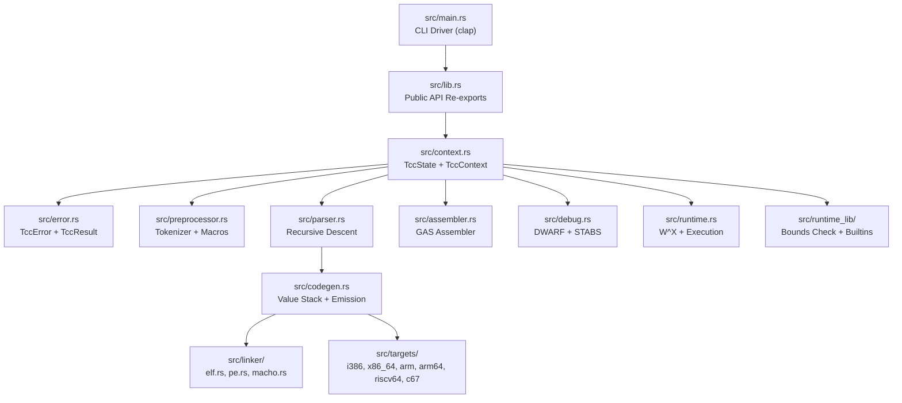

# Technical Specification

# 0. Agent Action Plan

## 0.1 Intent Clarification

### 0.1.1 Core Refactoring Objective

Based on the prompt, the Blitzy platform understands that the refactoring objective is to perform a **full-fidelity, complete tech stack migration** of TinyCC (Tiny C Compiler) version 0.9.28rc from its original C (C99 with GNU extensions) implementation into idiomatic, memory-safe Rust (2021 edition). This is not a partial port or a wrapper — it is a ground-up translation of approximately 57,000 lines of C across 17 core modules, 6 architecture backends, and 18 runtime library files into a unified Rust crate named `tinycc-rs`.

- **Refactoring type**: Tech stack migration (C → Rust) with simultaneous security remediation
- **Target repository**: Same repository — the Rust crate replaces the C source as the primary build artifact
- **Source version**: TinyCC v0.9.28rc from https://github.com/TinyCC/tinycc (mob branch)
- **Target language**: Rust 2021 edition, MSRV 1.70

The refactoring goals, stated with enhanced clarity, are:

- **Complete language migration**: Every C function across all 17+ core modules must have a Rust equivalent — no functions may be skipped or deferred
- **CVE remediation by construction**: Four known CVEs (CVE-2018-20376, CVE-2018-20374, CVE-2019-9754, CVE-2006-0635) must be eliminated as a natural consequence of Rust's memory safety guarantees, not through special-case patches
- **Public API preservation**: The 22-function libtcc API contract defined in `libtcc.h` must be preserved as methods on a `TccContext` Rust struct, maintaining behavioral equivalence for all embedders
- **Self-hosting capability**: The Rust port must be capable of compiling the original TinyCC C source code, passing a three-stage bootstrap check where Stage 1 and Stage 2 binaries produce identical output
- **Full test suite compatibility**: The Rust binary must pass the complete TinyCC test suite including `tcctest.c`, `abitest.c`, `boundtest.c`, `libtcc_test.c`, `libtcc_test_mt.c`, all preprocessor tests in `tests/pp/`, and all 260+ regression tests in `tests/tests2/`

Implicit requirements surfaced from the specification:

- **Backward-compatible CLI**: All GCC-compatible flags (`-c`, `-o`, `-I`, `-D`, `-U`, `-L`, `-l`, `-run`, `-b`, `-g`, `-gdwarf`, `-O`, `-W`, `-f*`, `-m*`) must be preserved in the Rust CLI driver
- **Multi-platform output**: ELF, PE/COFF, and Mach-O linker backends must all be ported, preserving cross-platform executable generation
- **Thread safety**: `TccContext` must implement `Send` to support multi-threaded libtcc usage as validated by `libtcc_test_mt.c`
- **Zero `unsafe` in safe paths**: The only permitted `unsafe` blocks are for platform syscalls (`mprotect`, `VirtualProtect`, `mmap`) in `src/runtime.rs`, each requiring a `// SAFETY:` justification comment

### 0.1.2 Technical Interpretation

This refactoring translates to the following technical transformation strategy:

The current TinyCC architecture is a monolithic C codebase organized as a set of `.c` source files sharing a single 2,016-line header (`tcc.h`) that defines all types, macros, and function prototypes. The global `TCCState` struct (tcc.h lines 738–1020) is passed by pointer through nearly every function, serving as the universal context for compilation state.

The target Rust architecture preserves TinyCC's single-pass compilation model (parser emits code directly, no AST) but restructures the monolith into clearly separated Rust modules with well-defined boundaries:



The transformation rules governing every module are:

- **Pointer arithmetic → slice/Vec indexing**: All raw pointer operations become bounds-checked slice or `Vec` operations
- **malloc/free → Rust allocator**: All manual memory management becomes `Vec`, `Box`, `String`, or `HashMap` with automatic deallocation via `Drop`
- **setjmp/longjmp → Result + ?**: All non-local error jumps become `Result<T, TccError>` with the `?` operator for propagation
- **TCCState* → TccContext**: The global state struct becomes an owned `TccState` wrapped in a `TccContext` handle with all fields using owned Rust types
- **static mut → owned state**: No mutable global state; all state is owned by the `TccContext` instance
- **Implicit integer coercion → explicit checked casts**: All integer conversions use `.try_into()` or explicit checked arithmetic

## 0.2 Source Analysis

### 0.2.1 Comprehensive Source File Discovery

The TinyCC v0.9.28rc repository comprises approximately 72,741 lines of C/header source code in the root directory and 8,319 lines of C/assembly in the `lib/` runtime directory, totaling roughly 81,060 lines of source code requiring translation. The repository was inspected exhaustively using `wc -l` and `get_source_folder_contents` across all directories.

### 0.2.2 Core Compiler Modules (Root Directory — 33,254 lines)

| Source File | LOC | Role | CVEs |
|---|---|---|---|
| `tcc.c` | 428 | CLI driver — argument parsing, main loop, help/version | — |
| `libtcc.c` | 2,272 | Compiler library orchestration — 22 public API functions, memory allocation, file handling | — |
| `tccpp.c` | 4,005 | Preprocessor — lexer, macro expansion, include caching, directives | CVE-2019-9754 |
| `tccgen.c` | 8,920 | Parser + code generator — recursive descent, value stack, constant folding (largest module) | CVE-2006-0635 |
| `tccasm.c` | 1,466 | Integrated assembler — GAS syntax, directive parsing, inline asm | CVE-2018-20376, CVE-2018-20374 |
| `tccelf.c` | 4,116 | ELF linker — sections, relocations, GOT/PLT, RELRO, transaction boundaries | — |
| `tccpe.c` | 2,114 | PE/COFF linker — Windows DLL/EXE generation, import/export tables | — |
| `tccmacho.c` | 2,476 | Mach-O linker — macOS executable/dylib, TBD stub parsing | — |
| `tccrun.c` | 1,556 | Runtime engine — W^X enforcement, in-memory execution, signal handlers, SELinux | — |
| `tccdbg.c` | 2,676 | Debug engine — STABS and DWARF generation, code coverage instrumentation | — |
| `tcctools.c` | 651 | Utility tools — archiver (`-ar`), dependency generator, impdef | — |
| `tcccoff.c` | 951 | COFF output backend for C67 target | — |

### 0.2.3 Architecture Backends (Root Directory — 21,811 lines)

| Source Files | LOC | Architecture | Components |
|---|---|---|---|
| `i386-gen.c`, `i386-asm.c`, `i386-link.c`, `i386-tok.h`, `i386-asm.h` | 1,306 + 1,757 + 329 + 332 + 490 = 4,214 | x86 (32-bit) | Code gen, assembler, linker, tokens |
| `x86_64-gen.c`, `x86_64-link.c`, `x86_64-asm.h` | 2,313 + 410 + 559 = 3,282 | x86-64 | Code gen, linker, assembler defs |
| `arm-gen.c`, `arm-asm.c`, `arm-link.c`, `arm-tok.h` | 2,385 + 3,092 + 445 + 406 = 6,328 | ARM (32-bit) | Code gen, assembler, linker, tokens |
| `arm64-gen.c`, `arm64-asm.c`, `arm64-link.c` | 2,209 + 94 + 322 = 2,625 | AArch64 | Code gen, assembler, linker |
| `riscv64-gen.c`, `riscv64-asm.c`, `riscv64-link.c`, `riscv64-tok.h` | 1,434 + 2,628 + 419 + 490 = 4,971 | RISC-V 64 | Code gen, assembler, linker, tokens |
| `c67-gen.c`, `c67-link.c` | 2,543 + 125 = 2,668 | TMS320C67 (DSP) | Code gen, linker |

### 0.2.4 Shared Headers (Root Directory — 7,344 lines)

| Header File | LOC | Role |
|---|---|---|
| `tcc.h` | 2,016 | Monolithic internal header — all types, macros, backend interface, TCCState struct |
| `libtcc.h` | 128 | Public API — 22+ functions for embedding |
| `tcctok.h` | 430 | Token definitions — keyword and operator token IDs |
| `elf.h` | 3,324 | ELF format definitions — structures, constants, relocation types |
| `dwarf.h` | 1,046 | DWARF debug format constants |
| `coff.h` | 446 | COFF format header definitions |
| `stab.h` + `stab.def` | 17 + 234 = 251 | STABS debug symbol definitions |
| `il-opcodes.h` | 251 | IL opcode definitions (experimental) |

### 0.2.5 Runtime Library (`lib/` — 8,319 lines)

| Source File | LOC | Role |
|---|---|---|
| `lib/bcheck.c` | 2,261 | Bounds-checking runtime — splay tree, memory region tracking, __bound_* wrappers |
| `lib/libtcc1.c` | 635 | 64-bit arithmetic helpers — division, modulo, shift, float conversion |
| `lib/lib-arm64.c` | 693 | ARM64 soft-float long double arithmetic |
| `lib/armeabi.c` | 642 | ARM EABI helper functions |
| `lib/tcov.c` | 428 | Code coverage runtime — merge coverage data, annotated reports |
| `lib/atomic.S` | 2,669 | Multi-arch atomic operations (x86, ARM, AArch64, RISC-V) |
| `lib/alloca.S` + `lib/alloca-bt.S` | 148 + 200 = 348 | Stack allocation helpers with bounds instrumentation |
| `lib/bt-exe.c`, `lib/bt-log.c`, `lib/bt-dll.c` | 68 + 56 + 74 = 198 | Backtrace infrastructure — exe, logging, DLL stub |
| `lib/builtin.c` | 164 | Compiler builtins — ffs, clz, ctz, popcount, parity |
| `lib/runmain.c` | 86 | Constructor/destructor handling, atexit tables |
| `lib/stdatomic.c` | 104 | Atomic operation wrappers for libtcc1.a |
| `lib/armflush.c` | 51 | ARM instruction cache flush |
| `lib/pic86.S` | 39 | x86 PIC thunk helpers |
| `lib/dsohandle.c` | 1 | DSO handle symbol |

### 0.2.6 Additional Source Files

| Source File | LOC | Role |
|---|---|---|
| `il-gen.c` | 657 | Experimental IL code generator (CIL/MSIL backend) |
| `conftest.c` | 308 | Configure-time feature detection test program |

### 0.2.7 Test Suite (Reference Only — Not Translated, Used for Validation)

| Test Directory/File | Contents | Purpose |
|---|---|---|
| `tests/tcctest.c` | Flagship regression driver with hundreds of `RUN(test)` cases | Language feature coverage |
| `tests/abitest.c` | In-memory ABI harness using libtcc | Struct layout, calling convention, varargs |
| `tests/boundtest.c` | 18 OOB/use-after-free/double-free scenarios | Bounds checker validation |
| `tests/libtcc_test.c` | Single-threaded libtcc API lifecycle | Compile → relocate → get_symbol → delete |
| `tests/libtcc_test_mt.c` | Multi-threaded libtcc usage | Concurrent TccContext safety |
| `tests/pp/` | 49 preprocessor regression fixtures | Macro, stringize, __COUNTER__ |
| `tests/tests2/` | 260+ numbered regression programs | Control flow, attributes, atomics, builtins |
| `tests/vla_test.c` | Variable-length array stack tests | VLA allocation/reclamation |
| `tests/asmtest.S` | Comprehensive x86/x86_64 assembly fixture | GAS/TCC assembler parity |

### 0.2.8 Current Structure Mapping

```
Current (TinyCC C — Root):
├── tcc.c                    (428 lines — CLI driver)
├── libtcc.c                 (2,272 lines — compiler core / public API)
├── libtcc.h                 (128 lines — public API header)
├── tcc.h                    (2,016 lines — monolithic internal header)
├── tccpp.c                  (4,005 lines — preprocessor) [CVE-2019-9754]
├── tccgen.c                 (8,920 lines — parser + codegen) [CVE-2006-0635]
├── tccasm.c                 (1,466 lines — assembler) [CVE-2018-20376, CVE-2018-20374]
├── tccelf.c                 (4,116 lines — ELF linker)
├── tccpe.c                  (2,114 lines — PE/COFF linker)
├── tccmacho.c               (2,476 lines — Mach-O linker)
├── tccrun.c                 (1,556 lines — runtime engine)
├── tccdbg.c                 (2,676 lines — debug info)
├── tcctools.c               (651 lines — archiver/tools)
├── tcccoff.c                (951 lines — COFF backend)
├── tcctok.h                 (430 lines — token defs)
├── i386-gen.c / i386-asm.c / i386-link.c / i386-tok.h / i386-asm.h
├── x86_64-gen.c / x86_64-link.c / x86_64-asm.h
├── arm-gen.c / arm-asm.c / arm-link.c / arm-tok.h
├── arm64-gen.c / arm64-asm.c / arm64-link.c
├── riscv64-gen.c / riscv64-asm.c / riscv64-link.c / riscv64-tok.h
├── c67-gen.c / c67-link.c
├── elf.h / dwarf.h / coff.h / stab.h / stab.def
├── il-gen.c / il-opcodes.h  (experimental)
├── conftest.c               (build-time test)
├── Makefile                 (build orchestration)
├── include/                 (10 minimal C standard headers)
├── lib/                     (18 runtime library files — 8,319 lines)
├── tests/                   (regression suite)
├── win32/                   (Windows build/runtime)
├── examples/                (5 demo programs)
└── .github/workflows/       (CI pipeline)
```

## 0.3 Scope Boundaries

### 0.3.1 Exhaustively In Scope

**Source Transformations (C → Rust):**
- `tcc.c` → `src/main.rs` — CLI driver with clap argument parsing
- `libtcc.c` → `src/lib.rs` + `src/context.rs` — Public API re-exports and TccState implementation
- `tccpp.c` → `src/preprocessor.rs` — Tokenizer, macro engine, include caching
- `tccgen.c` → `src/parser.rs` + `src/codegen.rs` — Recursive-descent parser and value stack emission
- `tccasm.c` → `src/assembler.rs` — GAS-style assembler and inline asm
- `tccelf.c` → `src/linker/elf.rs` — ELF object/executable/shared library output
- `tccpe.c` → `src/linker/pe.rs` — Windows PE/COFF DLL and EXE generation
- `tccmacho.c` → `src/linker/macho.rs` — macOS executable and dylib output
- `tccrun.c` → `src/runtime.rs` — W^X enforcement, in-memory execution, signal handlers
- `tccdbg.c` → `src/debug.rs` — STABS and DWARF debug info, code coverage
- `tcctools.c` → `src/tools.rs` — Archiver, dependency generator, impdef
- `tcccoff.c` → `src/linker/coff.rs` — COFF output for C67 target
- `i386-gen.c` + `i386-asm.c` + `i386-link.c` → `src/targets/i386.rs` — x86 32-bit backend
- `x86_64-gen.c` + `x86_64-link.c` → `src/targets/x86_64.rs` — x86-64 backend
- `arm-gen.c` + `arm-asm.c` + `arm-link.c` → `src/targets/arm.rs` — ARM 32-bit backend
- `arm64-gen.c` + `arm64-asm.c` + `arm64-link.c` → `src/targets/arm64.rs` — AArch64 backend
- `riscv64-gen.c` + `riscv64-asm.c` + `riscv64-link.c` → `src/targets/riscv64.rs` — RISC-V 64 backend
- `c67-gen.c` + `c67-link.c` → `src/targets/c67.rs` — TMS320C67 DSP backend
- `lib/bcheck.c` → `src/runtime_lib/bcheck.rs` — Bounds-checking runtime
- `lib/libtcc1.c` → `src/runtime_lib/libtcc1.rs` — 64-bit arithmetic helpers
- `lib/tcov.c` → `src/runtime_lib/tcov.rs` — Code coverage runtime
- `lib/bt-exe.c` + `lib/bt-log.c` + `lib/bt-dll.c` → `src/runtime_lib/backtrace.rs` — Backtrace infrastructure
- `lib/builtin.c` → `src/runtime_lib/builtin.rs` — Compiler builtins
- `lib/runmain.c` → `src/runtime_lib/runmain.rs` — Constructor/destructor handling
- `lib/armeabi.c` → `src/runtime_lib/armeabi.rs` — ARM EABI helpers
- `lib/lib-arm64.c` → `src/runtime_lib/arm64_math.rs` — ARM64 soft-float long double
- `lib/armflush.c` → `src/runtime_lib/armflush.rs` — ARM cache flush
- `lib/stdatomic.c` → `src/runtime_lib/stdatomic.rs` — Atomic operation wrappers
- `lib/dsohandle.c` → `src/runtime_lib/dsohandle.rs` — DSO handle symbol

**Header Translations:**
- `tcc.h` → distributed across Rust module-level type definitions and `src/types.rs`
- `libtcc.h` → `src/lib.rs` public trait/struct surface
- `tcctok.h` → `src/tokens.rs` — Token enum variants
- `elf.h` → `src/formats/elf.rs` — ELF struct definitions
- `dwarf.h` → absorbed by `gimli` crate or `src/formats/dwarf.rs`
- `coff.h` → `src/formats/coff.rs` — COFF struct definitions
- `stab.h` + `stab.def` → `src/formats/stab.rs` — STABS definitions
- `i386-tok.h`, `arm-tok.h`, `riscv64-tok.h` → integrated into respective `src/targets/{arch}.rs`
- `i386-asm.h`, `x86_64-asm.h` → integrated into respective target modules

**Assembly Translations:**
- `lib/alloca.S` + `lib/alloca-bt.S` → `src/runtime_lib/alloca.rs` (Rust reimplementation where possible, `global_asm!` where required)
- `lib/atomic.S` → `src/runtime_lib/atomic.rs` (leveraging `std::sync::atomic` or `global_asm!` for platform-specific paths)
- `lib/pic86.S` → `src/runtime_lib/pic86.rs` (x86 PIC thunk generation)

**New Files (No C Source Equivalent):**
- `src/error.rs` — `TccError` enum and `TccResult<T>` type alias
- `src/linker/mod.rs` — Linker module aggregation
- `src/targets/mod.rs` — Target backend trait and module aggregation
- `src/runtime_lib/mod.rs` — Runtime library module aggregation
- `src/formats/mod.rs` — Binary format structure definitions
- `Cargo.toml` — Rust package manifest with all dependencies and features
- `tests/cve_regressions.rs` — CVE-specific regression tests (4 tests)
- `.cargo/config.toml` — Cargo configuration for Clippy lints

**Test Harness (New Rust Tests Validating C Test Suite):**
- `tests/cve_regressions.rs` — 4 CVE-specific regression tests
- `tests/` directory — Harnesses invoking original TinyCC test suite files against the Rust binary

**Configuration and Documentation:**
- `Cargo.toml` — Package manifest matching the user-specified template
- `README.md` — Updated for Rust build instructions
- `.cargo/config.toml` — Clippy lint configuration

### 0.3.2 Explicitly Out of Scope

- **Win32 build scripts**: `win32/build-tcc.bat` — Windows batch build orchestration (replaced by Cargo)
- **Win32 runtime stubs**: `win32/lib/` — Windows CRT startup files (`wincrt1.c`, `crt1.c`, `dllcrt1.c`, `dllmain.c`, `chkstk.S`) and `.def` files — these are consumed by the compiler's output, not the compiler itself
- **Win32 compatibility headers**: `win32/include/` — MinGW-compatible headers shipped with TCC for Windows target compilation, not part of the compiler implementation
- **Win32 examples**: `win32/examples/` — Windows-specific sample programs
- **Root examples**: `examples/` — TCC demo programs (`ex1.c` through `ex5.c`)
- **Configure script**: `configure` — replaced by Cargo's build system
- **Root Makefile**: `Makefile` — replaced by Cargo's build system
- **Perl script**: `texi2pod.pl` — documentation tooling
- **Texinfo docs**: `tcc-doc.texi` — preserved as reference but not translated
- **CI pipeline**: `.github/workflows/build.yml` — will need a new Rust-oriented CI pipeline (out of scope for refactoring, may be generated separately)
- **Experimental IL backend**: `il-gen.c` and `il-opcodes.h` — experimental CIL/MSIL backend not included in standard builds
- **Configure test**: `conftest.c` — build-time feature detection replaced by Cargo features and `cfg()` attributes
- **tcclib.h**: Minimal libc replacement header — not part of compiler implementation
- **Test source files**: `tests/*.c`, `tests/pp/*`, `tests/tests2/*` — these C source files are test inputs to be compiled *by* the Rust port, not translated *into* Rust

## 0.4 Target Design

### 0.4.1 Refactored Structure Planning

The target Rust crate `tinycc-rs` is structured as a hybrid crate producing three library outputs (`cdylib`, `staticlib`, `rlib`) and one binary (`src/main.rs`). The directory layout follows Rust conventions while preserving a clear mapping to the original C module boundaries.

```
Target (tinycc-rs — Rust Crate):
├── Cargo.toml                          (package manifest — user-specified template)
├── .cargo/
│   └── config.toml                     (Clippy lint configuration)
├── src/
│   ├── main.rs                         (CLI driver — clap derive API)
│   ├── lib.rs                          (public API re-exports — 22-function libtcc equivalent)
│   ├── error.rs                        (TccError enum + TccResult type alias)
│   ├── context.rs                      (TccState struct + TccContext handle)
│   ├── tokens.rs                       (Token enum — all TCC token types)
│   ├── types.rs                        (shared type definitions from tcc.h)
│   ├── preprocessor.rs                 (tokenizer, macros, includes, directives)
│   ├── parser.rs                       (recursive-descent parser)
│   ├── codegen.rs                      (value stack, code emission, constant folding)
│   ├── assembler.rs                    (GAS-style assembler, inline asm)
│   ├── debug.rs                        (STABS + DWARF generation, coverage hooks)
│   ├── runtime.rs                      (W^X, in-memory execution, signal handlers)
│   ├── tools.rs                        (archiver, dependency generator, impdef)
│   ├── linker/
│   │   ├── mod.rs                      (linker module aggregation)
│   │   ├── elf.rs                      (ELF object/executable/shared library)
│   │   ├── pe.rs                       (PE/COFF DLL and EXE — Windows)
│   │   ├── macho.rs                    (Mach-O executable/dylib — macOS)
│   │   └── coff.rs                     (COFF output — C67 target)
│   ├── targets/
│   │   ├── mod.rs                      (CodegenBackend trait + target dispatch)
│   │   ├── i386.rs                     (x86 32-bit code gen, asm, link)
│   │   ├── x86_64.rs                   (x86-64 code gen, link)
│   │   ├── arm.rs                      (ARM 32-bit code gen, asm, link)
│   │   ├── arm64.rs                    (AArch64 code gen, asm, link)
│   │   ├── riscv64.rs                  (RISC-V 64 code gen, asm, link)
│   │   └── c67.rs                      (TMS320C67 code gen, link)
│   ├── runtime_lib/
│   │   ├── mod.rs                      (runtime library module aggregation)
│   │   ├── bcheck.rs                   (bounds-checking — BTreeMap region tracker)
│   │   ├── libtcc1.rs                  (64-bit arithmetic helpers)
│   │   ├── tcov.rs                     (code coverage runtime)
│   │   ├── backtrace.rs                (backtrace — exe, log, DLL)
│   │   ├── builtin.rs                  (compiler builtins — ffs, clz, ctz)
│   │   ├── runmain.rs                  (constructor/destructor handling)
│   │   ├── armeabi.rs                  (ARM EABI helpers)
│   │   ├── arm64_math.rs              (ARM64 soft-float long double)
│   │   ├── armflush.rs                 (ARM instruction cache flush)
│   │   ├── alloca.rs                   (stack allocation helpers)
│   │   ├── atomic.rs                   (atomic operation wrappers)
│   │   ├── stdatomic.rs                (C11 atomic wrappers)
│   │   ├── pic86.rs                    (x86 PIC thunk helpers)
│   │   └── dsohandle.rs                (DSO handle symbol)
│   └── formats/
│       ├── mod.rs                      (format definitions module)
│       ├── elf.rs                      (ELF struct definitions from elf.h)
│       ├── dwarf.rs                    (DWARF constants — supplement to gimli)
│       ├── coff.rs                     (COFF struct definitions from coff.h)
│       └── stab.rs                     (STABS definitions from stab.h/stab.def)
├── tests/
│   └── cve_regressions.rs             (4 CVE-specific regression tests)
├── include/                            (preserved — shipped with compiler for target headers)
├── tests/                              (preserved — C test suite inputs for validation)
└── README.md                           (updated with Rust build instructions)
```

### 0.4.2 Research Conducted

- **C-to-Rust migration best practices**: The translation strategy follows established patterns for porting large C codebases to Rust, using safe wrappers with minimal `unsafe` at platform boundaries
- **Rust compiler plugin architecture**: The `CodegenBackend` trait pattern is modeled after Rust's own `rustc_codegen_ssa::traits` approach to backend abstraction
- **ELF/PE/Mach-O handling in Rust**: Libraries like `object`, `goblin`, and `zerocopy` provide idiomatic patterns; the user specifies `zerocopy` and `bytemuck` for struct serialization
- **DWARF generation in Rust**: The `gimli` crate (v0.28 with `write` feature) provides a proven DWARF writer, as recommended by the user specification
- **Parser combinator patterns**: The `nom` crate (v7) specified for TBD file parsing follows Rust conventions for safe binary format parsing
- **Error handling**: The `thiserror` crate (v1) specified by the user for derive-based error types is the standard library ecosystem choice

### 0.4.3 Design Pattern Applications

- **Trait-based backend polymorphism**: `trait CodegenBackend` with methods matching the 25+ backend interface functions defined in `tcc.h` (lines 1619–1648) — each architecture implements this trait
- **Owned context pattern**: `TccContext` wraps `TccState` as an opaque owned handle, replacing the C pattern of passing `TCCState*` through every function
- **Builder pattern for compilation**: The libtcc API lifecycle (new → set_output_type → add_file → compile → relocate → get_symbol → delete) maps naturally to a Rust builder with type-state enforcement
- **Module-private internals**: `TccState` fields are `pub(crate)` — only `TccContext` methods are public, matching the C opaque-pointer pattern
- **Result-based error propagation**: Every fallible operation returns `TccResult<T>`, replacing all setjmp/longjmp paths with `?` operator chains
- **Feature-gated architecture backends**: Cargo features (`x86_64`, `i386`, `arm`, `arm64`, `riscv64`) control which backend modules are compiled, matching the C `#ifdef` pattern
- **Cfg-gated platform code**: `cfg(target_os = "windows")` for PE linker paths, `cfg(target_os = "macos")` for Mach-O paths, `cfg(feature = "selinux")` for SELinux paired mmap flow

### 0.4.4 Key C → Rust Type Mapping Decisions

| C Type / Pattern | Rust Equivalent | Rationale |
|---|---|---|
| `TCCState*` | `TccContext` (owned handle wrapping `TccState`) | Owned semantics, no raw pointers |
| `tcc_malloc` / `tcc_free` | Standard Rust allocator (`Vec`, `Box`, `String`) | RAII-based automatic deallocation |
| `setjmp` / `longjmp` | `Result<T, TccError>` + `?` operator | Structured error propagation |
| `Section.data` (raw buffer) | `Vec<u8>` | Growable, bounds-checked byte buffer |
| Symbol hash table | `HashMap<String, Symbol>` | Standard Rust hash map |
| Macro stack (`SValue[512]`) | `Vec<SValue>` | Dynamic size, safe push/pop |
| `BufferedFile` (8192-byte I/O) | `BufReader<File>` | Standard buffered I/O |
| `tcc_compile_sem` (semaphore) | `Mutex<()>` | Rust mutual exclusion primitive |
| `signal_set` counter | `AtomicUsize` | Lock-free atomic counter |
| `mprotect` / `VirtualProtect` | `unsafe fn protect_pages()` with `// SAFETY:` | Only permitted unsafe blocks |
| `#define free` (compile-time error) | `#![deny(clippy::...)]` lint gates | Compile-time safety enforcement |
| `CachedInclude` hash table | `HashMap<PathBuf, CachedInclude>` | Path-keyed include cache |
| Splay tree (`bcheck.c`) | `BTreeMap<usize, Region>` | Address-keyed, supports range queries |
| `pthread_spinlock_t` | `std::sync::Mutex<T>` | Portable synchronization |
| TLS `no_checking` flag | `thread_local!(static NO_CHECKING: Cell<bool>)` | Thread-local storage |
| Fixed-size C arrays | `Vec<T>` with bounds checking | CVE remediation — eliminates OOB writes |
| Implicit signed/unsigned coercion | Explicit `TryInto` conversions | CVE-2006-0635 remediation |

## 0.5 Transformation Mapping

### 0.5.1 File-by-File Transformation Plan

The entire refactoring is executed by Blitzy in ONE phase. Every target file is mapped to its source file(s) below.

**Core Compiler Modules:**

| Target File | Transformation | Source File(s) | Key Changes |
|---|---|---|---|
| `Cargo.toml` | CREATE | — | Package manifest per user-specified template: name `tinycc-rs`, version `0.9.28-rc.0`, edition 2021, all dependencies and features |
| `.cargo/config.toml` | CREATE | — | Clippy lint configuration: `deny(clippy::cast_sign_loss, clippy::cast_possible_truncation, clippy::cast_possible_wrap)` |
| `src/error.rs` | CREATE | `tcc.h` (error categories) | Define `TccError` enum with `Parse`, `Link`, `Io`, `UnsupportedTarget` variants using `thiserror::Error` derive; define `TccResult<T>` type alias |
| `src/context.rs` | CREATE | `libtcc.c`, `tcc.h` (lines 738–1020) | Translate `TCCState` struct to `TccState` with all owned Rust types; implement `TccContext` wrapper with 22 API methods; `Drop` impl replaces `tcc_delete`; `Mutex<()>` for compile serialization |
| `src/lib.rs` | CREATE | `libtcc.c`, `libtcc.h` | Public API re-exports; module declarations; crate-level `#![deny(...)]` lint attributes; `#[must_use]` on `TccResult` returns |
| `src/main.rs` | CREATE | `tcc.c` | CLI driver using `clap` derive API; all GCC-compatible flags (`-c`, `-o`, `-I`, `-D`, `-U`, `-L`, `-l`, `-run`, `-b`, `-g`, `-gdwarf`, `-O`, `-W`, `-f*`, `-m*`); delegates to `TccContext` methods; exit code 0/1 |
| `src/tokens.rs` | CREATE | `tcctok.h`, `tcc.h` (token defs) | Token enum covering all TCC token types (`TOK_*`, `VT_*` constants) |
| `src/types.rs` | CREATE | `tcc.h` (struct defs) | Shared types: `SValue` (enum/struct with discriminated union), `Section`, `Symbol`, `CType`, `Sym`, `BufferedFile` equivalents |
| `src/preprocessor.rs` | CREATE | `tccpp.c` | Tokenizer, macro expansion via `Vec<MacroEntry>` (CVE-2019-9754 fix), `HashMap<PathBuf, CachedInclude>` for include cache, `BufReader<File>` for buffered I/O, `fn next_token(&mut self) -> TccResult<Token>` interface |
| `src/parser.rs` | CREATE | `tccgen.c` (parser functions) | Recursive-descent parser methods; single-pass architecture preserved (emit code directly, no AST); explicit `TryInto` conversions for signed/unsigned comparisons (CVE-2006-0635 fix) |
| `src/codegen.rs` | CREATE | `tccgen.c` (codegen functions) | Value stack as `Vec<SValue>` with push/pop; constant folding preserved; code emission to backend via `CodegenBackend` trait |
| `src/assembler.rs` | CREATE | `tccasm.c` | GAS syntax parsing; directive buffer as `Vec<u8>` (CVE-2018-20376 fix); section array as `Vec<Section>` with `.get_mut(idx).ok_or(...)` (CVE-2018-20374 fix); inline asm interop with `codegen.rs` |
| `src/debug.rs` | CREATE | `tccdbg.c` | STABS generation; DWARF generation via `gimli::write` module; `HashMap<String, u32>` for string deduplication; code coverage instrumentation hooks; interop with all linker backends |
| `src/runtime.rs` | CREATE | `tccrun.c` | `unsafe` blocks for `mprotect`/`VirtualProtect` with `// SAFETY:` comments; W^X page transitions; SELinux paired mmap (`cfg(feature = "selinux")`); signal handlers via `cfg` gates; `AtomicUsize` for `signal_set` counter; ARM/ARM64 cache flush |
| `src/tools.rs` | CREATE | `tcctools.c` | Archiver (`-ar`), dependency file generator, impdef tool |

**Linker Backends:**

| Target File | Transformation | Source File(s) | Key Changes |
|---|---|---|---|
| `src/linker/mod.rs` | CREATE | — | Module declarations for `elf`, `pe`, `macho`, `coff` |
| `src/linker/elf.rs` | CREATE | `tccelf.c` | ELF sections with `Vec<u8>` data buffers, `Vec<ElfRela>` relocations, `HashMap<String, Symbol>` symbol table; RELRO, GOT/PLT generation; transaction boundary via `Vec::truncate()` savepoint; all writes via `std::io::Write` |
| `src/linker/pe.rs` | CREATE | `tccpe.c` | `#[repr(C)]` PE header structs with `zerocopy::AsBytes`; import/export table generation; `cfg(target_os = "windows")` gating |
| `src/linker/macho.rs` | CREATE | `tccmacho.c` | `#[repr(C)]` Mach-O load command structs with `zerocopy::AsBytes`; TBD stub parsing via `nom`; `cfg(target_os = "macos")` gating |
| `src/linker/coff.rs` | CREATE | `tcccoff.c` | COFF output for C67 target |

**Architecture Backends:**

| Target File | Transformation | Source File(s) | Key Changes |
|---|---|---|---|
| `src/targets/mod.rs` | CREATE | `tcc.h` (lines 1619–1648) | Define `trait CodegenBackend` with `gen_op`, `load`, `store`, `gfunc_call`, `gfunc_prolog`, `gfunc_epilog`, `gjmp`, `gen_opi`, `gen_opf`, `gen_cvt_ftoi`, `gen_cvt_itof`, `gen_cvt_ftof`, `ggoto`, `gen_vla_sp_save`, `gen_vla_sp_restore`, `gen_vla_alloc` methods; runtime or compile-time target dispatch |
| `src/targets/i386.rs` | CREATE | `i386-gen.c`, `i386-asm.c`, `i386-link.c`, `i386-tok.h`, `i386-asm.h` | Implements `CodegenBackend`; explicit `u32`/`u16` bit operations for instruction encoding; typed relocation structs; `cfg(feature = "i386")` gating |
| `src/targets/x86_64.rs` | CREATE | `x86_64-gen.c`, `x86_64-link.c`, `x86_64-asm.h` | Implements `CodegenBackend`; 64-bit instruction encoding; REX prefix handling; `cfg(feature = "x86_64")` gating (default feature) |
| `src/targets/arm.rs` | CREATE | `arm-gen.c`, `arm-asm.c`, `arm-link.c`, `arm-tok.h` | Implements `CodegenBackend`; ARM/Thumb instruction encoding; register classes; `cfg(feature = "arm")` gating |
| `src/targets/arm64.rs` | CREATE | `arm64-gen.c`, `arm64-asm.c`, `arm64-link.c` | Implements `CodegenBackend`; AArch64 instruction encoding; `cfg(feature = "arm64")` gating |
| `src/targets/riscv64.rs` | CREATE | `riscv64-gen.c`, `riscv64-asm.c`, `riscv64-link.c`, `riscv64-tok.h` | Implements `CodegenBackend`; RISC-V instruction encoding; `cfg(feature = "riscv64")` gating |
| `src/targets/c67.rs` | CREATE | `c67-gen.c`, `c67-link.c` | Implements `CodegenBackend`; TMS320C67 DSP instruction encoding |

**Runtime Library:**

| Target File | Transformation | Source File(s) | Key Changes |
|---|---|---|---|
| `src/runtime_lib/mod.rs` | CREATE | — | Module declarations for all runtime library components |
| `src/runtime_lib/bcheck.rs` | CREATE | `lib/bcheck.c` | Splay tree → `BTreeMap<usize, Region>`; `__bound_*` functions as safe Rust with `.range()` queries; `Mutex<BTreeMap>` for synchronization; `thread_local!` for TLS `NO_CHECKING` flag |
| `src/runtime_lib/libtcc1.rs` | CREATE | `lib/libtcc1.c` | 64-bit division/modulo/shift helpers; unsigned-to-float conversions; Windows `__faststorefence` |
| `src/runtime_lib/tcov.rs` | CREATE | `lib/tcov.c` | Coverage blob merging; file locking; tcov_file/function/line record parsing |
| `src/runtime_lib/backtrace.rs` | CREATE | `lib/bt-exe.c`, `lib/bt-log.c`, `lib/bt-dll.c` | Backtrace initialization, logging, DLL helper resolution |
| `src/runtime_lib/builtin.rs` | CREATE | `lib/builtin.c` | De Bruijn tables for ffs/clz/ctz/popcount/parity |
| `src/runtime_lib/runmain.rs` | CREATE | `lib/runmain.c` | Constructor/destructor sequencing; atexit/on_exit tables |
| `src/runtime_lib/armeabi.rs` | CREATE | `lib/armeabi.c` | ARM EABI helpers: float-to-long-long, shift, division |
| `src/runtime_lib/arm64_math.rs` | CREATE | `lib/lib-arm64.c` | Soft-float quad-precision arithmetic: `__addtf3`, `__multf3`, `__divtf3`, conversions |
| `src/runtime_lib/armflush.rs` | CREATE | `lib/armflush.c` | `__clear_cache` via libc syscall wrapper |
| `src/runtime_lib/alloca.rs` | CREATE | `lib/alloca.S`, `lib/alloca-bt.S` | Stack allocation with optional bounds instrumentation |
| `src/runtime_lib/atomic.rs` | CREATE | `lib/atomic.S` | Atomic operations via `std::sync::atomic` or `global_asm!` for arch-specific paths |
| `src/runtime_lib/stdatomic.rs` | CREATE | `lib/stdatomic.c` | C11 `__atomic_*` operation wrappers |
| `src/runtime_lib/pic86.rs` | CREATE | `lib/pic86.S` | x86 PIC thunk helpers |
| `src/runtime_lib/dsohandle.rs` | CREATE | `lib/dsohandle.c` | `__dso_handle` symbol with hidden visibility |

**Format Definitions:**

| Target File | Transformation | Source File(s) | Key Changes |
|---|---|---|---|
| `src/formats/mod.rs` | CREATE | — | Module declarations for format definition submodules |
| `src/formats/elf.rs` | CREATE | `elf.h` | ELF struct definitions as `#[repr(C)]` Rust structs |
| `src/formats/dwarf.rs` | CREATE | `dwarf.h` | DWARF constants supplementing `gimli` crate |
| `src/formats/coff.rs` | CREATE | `coff.h` | COFF struct definitions as `#[repr(C)]` Rust structs |
| `src/formats/stab.rs` | CREATE | `stab.h`, `stab.def` | STABS debug symbol definitions |

**Test Files:**

| Target File | Transformation | Source File(s) | Key Changes |
|---|---|---|---|
| `tests/cve_regressions.rs` | CREATE | — | 4 CVE regression tests as specified by the user: `cve_2018_20376_no_oob_write_in_asm_parse_directive`, `cve_2018_20374_no_oob_write_in_use_section1`, `cve_2019_9754_no_oob_write_in_end_macro`, `cve_2006_0635_signed_unsigned_comparison_correctness` |

### 0.5.2 Cross-File Dependencies

**Import Transformation Rules:**

The C codebase uses `#include "tcc.h"` in every source file to access all shared declarations. In the Rust port, this monolithic include pattern is replaced by explicit module imports:

- Old: `#include "tcc.h"` (includes everything)
- New: `use crate::context::TccState;` + `use crate::error::{TccError, TccResult};` + `use crate::types::{SValue, Section, Symbol};` (precise imports)

Key import chains:

- `src/main.rs` → `use tcc::TccContext;` + `use clap::Parser;`
- `src/lib.rs` → `pub use context::TccContext;` + `pub use error::{TccError, TccResult};`
- `src/context.rs` → `use crate::error::*;` + `use crate::preprocessor::*;` + `use crate::parser::*;`
- `src/preprocessor.rs` → `use crate::context::TccState;` + `use crate::tokens::Token;` + `use crate::error::TccResult;`
- `src/parser.rs` → `use crate::codegen::*;` + `use crate::preprocessor::*;` + `use crate::targets::CodegenBackend;`
- `src/codegen.rs` → `use crate::types::SValue;` + `use crate::targets::CodegenBackend;`
- `src/assembler.rs` → `use crate::preprocessor::*;` + `use crate::codegen::*;`
- `src/linker/elf.rs` → `use crate::types::{Section, Symbol};` + `use crate::formats::elf::*;`
- `src/linker/pe.rs` → `use crate::formats::coff::*;` + `use zerocopy::AsBytes;`
- `src/linker/macho.rs` → `use nom::*;` + `use zerocopy::AsBytes;`
- `src/debug.rs` → `use gimli::write::*;` + `use crate::linker::*;`
- `src/runtime.rs` → `use libc::*;` (behind `cfg(unix)`) + `use crate::linker::*;`
- `src/targets/*.rs` → `use crate::targets::CodegenBackend;` + `use crate::types::SValue;`

### 0.5.3 Wildcard Patterns

- `src/targets/*.rs` — All architecture backend files implementing `CodegenBackend`
- `src/linker/*.rs` — All output format backend files
- `src/runtime_lib/*.rs` — All runtime library component files
- `src/formats/*.rs` — All binary format definition files

### 0.5.4 One-Phase Execution

The entire refactoring is executed by Blitzy in ONE phase. All 50+ target files are generated in a single pass following the dependency order specified in Section 7 of the user's prompt template:

1. `src/error.rs` (no dependencies)
2. `src/context.rs` (depends on error.rs)
3. `src/preprocessor.rs` (depends on context.rs)
4. `src/assembler.rs` (depends on preprocessor.rs)
5. `src/targets/*.rs` (depends on context.rs)
6. `src/parser.rs` + `src/codegen.rs` (depends on all above)
7. `src/linker/elf.rs`, `pe.rs`, `macho.rs` (depends on codegen.rs)
8. `src/debug.rs` (depends on linker/)
9. `src/runtime.rs` (depends on linker/)
10. `src/runtime_lib/*.rs` (semi-independent)
11. `src/lib.rs` (public API re-exports)
12. `src/main.rs` (depends on lib.rs)
13. `tests/cve_regressions.rs` (integration tests)

## 0.6 Dependency Inventory

### 0.6.1 Key Public Packages

All dependency names and versions are taken exactly from the user-specified Cargo.toml template in Section 5 of the prompt document.

| Registry | Package | Version | Purpose | Status |
|---|---|---|---|---|
| crates.io | `thiserror` | `1` | `TccError` enum derive macro for `Display` and `Error` trait | Required — core dependency |
| crates.io | `clap` | `4` (features: `["derive"]`) | CLI argument parsing with `#[derive(Parser)]` | Required — `src/main.rs` only |
| crates.io | `libc` | `0.2` (optional) | Low-level platform syscalls: `mprotect`, `mmap`, `sigaction` | Optional — gated by `selinux` feature |
| crates.io | `gimli` | `0.28` (features: `["write"]`) | DWARF debug info generation via `gimli::write` module | Required — `src/debug.rs` |
| crates.io | `zerocopy` | `0.7` | Safe byte-level serialization for PE/Mach-O header structs via `AsBytes` | Required — `src/linker/pe.rs`, `src/linker/macho.rs` |
| crates.io | `bytemuck` | `1` | `Pod` trait for safe transmutation of header structs | Required — `src/linker/pe.rs`, `src/linker/macho.rs` |
| crates.io | `nom` | `7` | Parser combinator for TBD stub file parsing (Mach-O Apple SDK stubs) | Required — `src/linker/macho.rs` |
| crates.io | `winapi` | `0.3` (features: `["memoryapi", "errhandlingapi"]`) | Windows-specific: `VirtualProtect`, `SetUnhandledExceptionFilter` | Conditional — `cfg(windows)` only |
| crates.io | `tempfile` | `3` | Temporary file creation for test isolation | Dev-dependency only |

### 0.6.2 Rust Toolchain Requirements

| Component | Version | Justification |
|---|---|---|
| Rust Edition | 2021 | User-specified; required for latest language features |
| MSRV (Minimum Supported Rust Version) | 1.70 | User-specified in Cargo.toml template `rust-version = "1.70"` |
| Clippy Lints | `clippy::all` + `clippy::pedantic` | Zero warnings required; specific denials for integer safety |

### 0.6.3 Import Refactoring

Since this is a complete language migration (C → Rust) rather than an incremental refactoring, there are no existing Rust import statements to update. Instead, the import architecture is defined from scratch:

**Crate-Level Lint Configuration** (in `src/lib.rs`):
```rust
#![deny(clippy::cast_sign_loss)]
#![deny(clippy::cast_possible_truncation)]
```

**Module Import Pattern** — every Rust source file follows the same convention:
- `use crate::error::{TccError, TccResult};` — error types available everywhere
- `use crate::context::TccState;` — compiler state access
- `use crate::types::*;` — shared type definitions
- External crate imports at file top, crate-internal imports below

**Files Requiring External Crate Imports:**

| File Pattern | External Import | Purpose |
|---|---|---|
| `src/error.rs` | `use thiserror::Error;` | Error derive macro |
| `src/main.rs` | `use clap::Parser;` | CLI argument parser |
| `src/debug.rs` | `use gimli::write::*;` | DWARF generation |
| `src/linker/pe.rs` | `use zerocopy::AsBytes;` + `use bytemuck::Pod;` | PE header serialization |
| `src/linker/macho.rs` | `use zerocopy::AsBytes;` + `use nom::*;` | Mach-O headers + TBD parsing |
| `src/runtime.rs` | `use libc::*;` (behind `cfg(unix)`) | Platform syscalls |

### 0.6.4 External Reference Updates

**Configuration Files:**

| File | Change |
|---|---|
| `Cargo.toml` | CREATE — Full package manifest per user template with `[package]`, `[lib]`, `[features]`, `[dependencies]`, `[target]`, `[dev-dependencies]`, `[profile.release]` sections |
| `.cargo/config.toml` | CREATE — Clippy lint enforcement configuration |

**Build Configuration:**

The Cargo.toml must include the following exact structure per the user's specification:

- Package name: `tinycc-rs`
- Version: `0.9.28-rc.0`
- Library name: `tcc`
- Crate types: `["cdylib", "staticlib", "rlib"]`
- Default feature: `x86_64`
- Architecture features: `x86_64`, `i386`, `arm`, `arm64`, `riscv64`
- Special features: `selinux` (depends on `libc`), `bounds-checking`
- Release profile: `opt-level = 3`, `lto = true`, `codegen-units = 1`

## 0.7 Special Analysis

### 0.7.1 CVE Remediation Analysis

This section provides an in-depth analysis of the four known CVEs that must be remediated as a natural consequence of the C-to-Rust translation. Each CVE is analyzed with specific reference to the vulnerable C code patterns observed in the repository and the precise Rust constructs that eliminate the vulnerability.

**CVE-2018-20376 — Out-of-Bounds Write in `asm_parse_directive()` (CVSS 5.5 Medium)**

| Attribute | Detail |
|---|---|
| **Vulnerable File** | `tccasm.c` — function `asm_parse_directive()` at line 495 |
| **Root Cause** | The assembler directive parser performs raw pointer arithmetic to write directive output into a buffer without bounds checking. An 8-byte out-of-bounds write occurs when crafted assembly input causes the write pointer to advance past the allocated buffer length. |
| **C Pattern Observed** | The function at `tccasm.c:495` processes assembler directives (`.byte`, `.word`, `.long`, `.section`, etc.) and writes output to section data buffers using direct pointer manipulation. The section data buffers are managed as raw `malloc`'d byte arrays with manual length tracking. |
| **Rust Mitigation** | Replace the directive output buffer (raw `*mut u8` + length) with `Vec<u8>`. All writes use `.push()` or `.extend_from_slice()`. The `Vec` automatically grows as needed and panics on allocation failure — never permits silent out-of-bounds writes. Code comment required: `// CVE-2018-20376: Vec<u8> eliminates OOB write in directive buffer` |

**CVE-2018-20374 — Out-of-Bounds Write in `use_section1()` (CVSS 5.5 Medium)**

| Attribute | Detail |
|---|---|
| **Vulnerable File** | `tccasm.c` — function `use_section1()` at line 465 |
| **Root Cause** | Section arrays are accessed using integer indices without bounds validation. When deeply nested section directives trigger `use_section1()`, the index can exceed the allocated section array length (tracked by `s1->nb_sections` at `tcc.h:893`), causing an 8-byte out-of-bounds write into adjacent memory. |
| **C Pattern Observed** | The function `use_section1(TCCState *s1, Section *sec)` at line 465 of `tccasm.c` is called from multiple paths (lines 476, 483, 492, 933, 1401). The section array is a fixed-allocation C array indexed by integer, and `nb_sections` at `tcc.h:893` tracks the count without enforcing bounds at access time. |
| **Rust Mitigation** | Replace the section array with `Vec<Section>`. All access via `.get_mut(idx).ok_or(TccError::Link("section index out of range".into()))?` — out-of-range access returns a recoverable error. Code comment required: `// CVE-2018-20374: Vec<Section> with checked indexing eliminates OOB write` |

**CVE-2019-9754 — Out-of-Bounds Write in `end_macro()` (CVSS 7.8 High)**

| Attribute | Detail |
|---|---|
| **Vulnerable File** | `tccpp.c` — function `end_macro()` at line 1067 |
| **Root Cause** | The macro expansion stack uses a linked-list structure with a `prev` pointer (observed at lines 1060–1071 of `tccpp.c`). The `end_macro()` function at line 1067 pops from this stack by following the `prev` pointer. When the stack is empty (all macros have been popped), `macro_stack` becomes NULL, but the decrement at line 1070 (`macro_stack = str->prev`) is executed without checking for underflow. A crafted macro invocation can trigger this underflow, causing a write past the base of the stack. |
| **C Pattern Observed** | At `tccpp.c:1062-1064`, `begin_macro()` pushes by setting `str->prev = macro_stack; macro_stack = str;`. At `tccpp.c:1069-1071`, `end_macro()` pops by dereferencing `macro_stack` to get `str`, then sets `macro_stack = str->prev` and `macro_ptr = str->prev_ptr`. The `while (macro_stack) end_macro();` cleanup at line 1337–1338 shows awareness of the NULL check but does not protect against all code paths. |
| **Rust Mitigation** | Model the macro stack as `Vec<MacroEntry>`. Stack push uses `Vec::push()`, stack pop uses `Vec::pop()`. When `pop()` returns `None` (stack empty), return `Err(TccError::Parse { ... })` instead of corrupting memory. Code comment required: `// CVE-2019-9754: Vec::pop() returns None on empty stack, preventing underflow` |

**CVE-2006-0635 — Signed/Unsigned Integer Comparison (CVSS Medium)**

| Attribute | Detail |
|---|---|
| **Vulnerable File** | `tccgen.c` — expression evaluation |
| **Root Cause** | The C expression `i > sizeof(int)` evaluates incorrectly when `i == -1` (a signed `int`). In C, the comparison implicitly promotes the signed value to `unsigned` via integer conversion rules (C99 §6.3.1.8), causing `-1` to become a very large unsigned value (e.g., `0xFFFFFFFF` on 32-bit), making the comparison incorrectly evaluate to `true`. |
| **C Pattern Observed** | In `tccgen.c`, multiple comparisons involve signed integer variables compared against `sizeof()` expressions or array length values. The pattern `(unsigned)v >= (unsigned)(tok_ident - TOK_IDENT)` at lines 705 and 714 shows awareness of the issue but uses explicit casts rather than systematic prevention. |
| **Rust Mitigation** | Rust's type system prevents implicit signed-to-unsigned coercion entirely. Any comparison of a signed integer against `usize` requires an explicit `TryInto` conversion: `i64::try_from(size_value)?` or `usize::try_from(signed_value).map_err(...)`. The crate-level `#![deny(clippy::cast_sign_loss)]` lint gate catches any future regressions at compile time. Code comment required: `// CVE-2006-0635: Explicit TryFrom prevents implicit signed/unsigned coercion` |

### 0.7.2 Cross-Cutting Safety Analysis

**`unsafe` Block Inventory:**

The user specification mandates that `unsafe` blocks are ONLY permitted in `src/runtime.rs` for platform syscall wrappers. Each `unsafe` block must include a `// SAFETY:` comment. The anticipated `unsafe` blocks are:

| Function | Platform | Syscall | Safety Justification |
|---|---|---|---|
| `protect_pages()` | Unix | `libc::mprotect` | Memory region is owned by `TccContext`, aligned to page boundary, and length is validated before call |
| `protect_pages()` | Windows | `VirtualProtect` | Same region ownership guarantees; Windows API handles alignment internally |
| `install_signal_handler()` | Unix | `libc::sigaction` | Signal handler function pointer is a valid Rust `extern "C" fn`; previous handler is saved for restoration |
| `install_signal_handler()` | Windows | `SetUnhandledExceptionFilter` | Exception filter function is a valid Rust `extern "system" fn`; global state is atomic |
| `selinux_mmap_pair()` | Unix (SELinux) | `libc::mmap` × 2 | File descriptor from `mkstemp` is valid; mapping sizes are validated; dual mapping provides W^X via separate RW and RX views |
| `flush_icache()` | ARM/ARM64 | Architecture-specific | Address range validated from section data; cache flush is a safe hardware operation |

**Thread Safety Analysis:**

- `TccContext` must implement `Send` — verified by ensuring `TccState` contains no `Rc`, `Cell` (non-`Sync`), or raw pointer fields in its public interface
- Compile serialization via `Mutex<()>` guard in `TccContext::compile()` replaces the C `tcc_compile_sem` semaphore
- The `signal_set` reference counter uses `AtomicUsize` for lock-free multi-instance safety
- Bounds checker synchronization uses `std::sync::Mutex<BTreeMap<usize, Region>>` replacing platform-specific spinlocks

### 0.7.3 Self-Hosting Validation Analysis

The self-hosting requirement is the ultimate integration test for the Rust port. The validation protocol requires:

- **Stage 1**: `cargo build --release` produces `./target/release/tcc` (the Rust-compiled TCC binary)
- **Stage 2**: `./target/release/tcc -I./include tcc.c -o tcc_stage1` — the Rust TCC compiles the original C TCC source
- **Stage 3**: `./tcc_stage1 -run tests/tcctest.c` — the C-compiled TCC runs the test suite
- **Bootstrap verification**: `tcc_stage1` compiles `tcc.c` again to produce `tcc_stage2`; `md5sum tcc_stage1` must equal `md5sum tcc_stage2`

This requires that the Rust port correctly implements:
- Complete C99 language parsing (recursive descent in `src/parser.rs`)
- Correct native code emission for the host architecture
- Working ELF/PE/Mach-O output generation
- Accurate symbol resolution and linking
- Runtime execution support for the `-run` flag

## 0.8 Refactoring Rules

### 0.8.1 Global Refactoring Rules

These rules apply to every module Blitzy generates. They must not be overridden by module-specific instructions.

**Memory Safety (Mandatory):**
- No `unsafe` blocks unless wrapping a platform syscall (`mprotect`, `VirtualProtect`, `mmap`). Every `unsafe` block must have a `// SAFETY:` comment justifying why the invariant holds
- No raw pointers (`*const T`, `*mut T`) in safe code paths. Use references, slices, `Vec`, or `Box` instead
- No manual `malloc`/`free` equivalents. All heap allocation must use Rust's standard allocator via `Vec`, `Box`, `String`, or a custom allocator implementing the `Allocator` trait
- Replace all `setjmp`/`longjmp` error handling with `Result<T, TccError>` and the `?` operator

**Integer Safety:**
- All integer casts must use explicit checked conversions: `.try_into().unwrap_or_default()` or `.try_into()?` — never `as usize` on signed values
- Enable `#![deny(clippy::cast_sign_loss, clippy::cast_possible_truncation, clippy::cast_possible_wrap)]` at crate root
- Arithmetic on sizes and offsets must use `checked_add()`, `checked_mul()`, `saturating_add()` as appropriate. Never rely on wrapping behavior

**Global State (TCCState):**
- Translate `TCCState` to a `struct TccState` with all fields using owned Rust types (`Vec`, `String`, `HashMap`, etc.)
- Do not use `static mut`. All state must be owned by a `TccContext` handle type returned from `tcc_new()`
- Thread safety: If a field must be shared across threads, wrap it in `Arc<Mutex<T>>` and document the rationale
- Lifetimes: Prefer owned types over lifetime-annotated references in `TccState` fields to avoid lifetime complexity in the public API

**Error Handling:**
- Define `TccError` at crate root using `thiserror::Error` derive with variants for `Parse`, `Link`, `Io`, `UnsupportedTarget`
- Define `pub type TccResult<T> = Result<T, TccError>;`
- All public API functions return `TccResult<T>` with `#[must_use]` attribute

**Code Style:**
- Rust 2021 edition, MSRV 1.70
- All public API items must have `///` doc comments explaining the C equivalent function name
- Use `#[must_use]` on all `TccResult` return values
- `clippy::all` and `clippy::pedantic` must pass with zero warnings. Use `#[allow(...)]` only when necessary, with an explanatory comment
- No `unwrap()` in library code paths. Use `expect("invariant: ...")` only when the invariant is truly unreachable and document why

### 0.8.2 CVE-Specific Mandatory Requirements

- **CVE-2018-20376**: Directive buffer in `src/assembler.rs` → `asm_parse_directive()` MUST use `Vec<u8>` — no raw pointer writes permitted
- **CVE-2018-20374**: Section array in `src/assembler.rs` → `use_section1()` MUST use `Vec<Section>` with `.get_mut(idx).ok_or(...)` — no unchecked indexing
- **CVE-2019-9754**: Macro stack in `src/preprocessor.rs` → `end_macro()` MUST use `Vec<MacroEntry>` with `Vec::pop()` — empty stack returns `Err`, not UB
- **CVE-2006-0635**: All signed/unsigned comparisons in `src/parser.rs` and `src/codegen.rs` MUST use explicit `TryInto` conversions — `#![deny(clippy::cast_sign_loss)]` enforced globally
- Blitzy does NOT need to write special-case CVE fix code. The act of translating to safe Rust is sufficient. Call this out explicitly in generated code comments

### 0.8.3 Architecture-Specific Rules

- Define `trait CodegenBackend` with methods matching `tcc.h` lines 1619–1648 backend interface contract
- Each architecture module implements `CodegenBackend` independently
- Instruction encoding must use explicit `u32`/`u16`/`u8` bit operations with named constants — no raw byte casts
- Relocation entries must be typed structs, not raw byte arrays
- Cross-compilation paths that are not immediately implementable must be flagged with `// TODO: cross-compile` comments
- Feature gating: `cfg(feature = "x86_64")`, `cfg(feature = "i386")`, etc. for each backend

### 0.8.4 Test Preservation Requirements

- The Rust port must pass the full TinyCC test suite (`tcctest.c`, `abitest.c`, `boundtest.c`, `libtcc_test.c`)
- Multi-threaded test (`libtcc_test_mt.c`) must pass — concurrent `TccContext` instances must compile correctly without data races
- All 49 preprocessor tests in `tests/pp/` must pass
- All 260+ regression tests in `tests/tests2/` must pass
- All 18 bounds-checking scenarios in `boundtest.c` must be detected correctly under `-b` flag equivalent
- CVE regression tests in `tests/cve_regressions.rs` must be generated and pass

### 0.8.5 Public API Contract Preservation

The 22 libtcc API functions defined in `libtcc.h` must be preserved as methods on `TccContext`:

| C Function | Rust Method | Notes |
|---|---|---|
| `tcc_set_realloc()` | Not applicable | Rust uses standard allocator; custom allocator via `Allocator` trait if needed |
| `tcc_new()` | `TccContext::new() -> TccResult<TccContext>` | Returns owned handle |
| `tcc_delete()` | `Drop` impl on `TccContext` | Automatic cleanup |
| `tcc_set_lib_path()` | `TccContext::set_lib_path(&mut self, path: &str)` | — |
| `tcc_set_error_func()` | `TccContext::set_error_func(&mut self, f: impl Fn(&str))` | Stored as `Option<Box<dyn Fn(&str)>>` |
| `tcc_set_options()` | `TccContext::set_options(&mut self, str: &str) -> TccResult<()>` | — |
| `tcc_add_include_path()` | `TccContext::add_include_path(&mut self, path: &str) -> TccResult<()>` | — |
| `tcc_add_sysinclude_path()` | `TccContext::add_sysinclude_path(&mut self, path: &str) -> TccResult<()>` | — |
| `tcc_define_symbol()` | `TccContext::define_symbol(&mut self, sym: &str, val: Option<&str>)` | — |
| `tcc_undefine_symbol()` | `TccContext::undefine_symbol(&mut self, sym: &str)` | — |
| `tcc_add_file()` | `TccContext::add_file(&mut self, filename: &str) -> TccResult<()>` | — |
| `tcc_compile_string()` | `TccContext::compile_string(&mut self, buf: &str) -> TccResult<()>` | — |
| `tcc_set_output_type()` | `TccContext::set_output_type(&mut self, output_type: OutputType) -> TccResult<()>` | Enum for output types |
| `tcc_add_library_path()` | `TccContext::add_library_path(&mut self, path: &str) -> TccResult<()>` | — |
| `tcc_add_library()` | `TccContext::add_library(&mut self, name: &str) -> TccResult<()>` | — |
| `tcc_add_symbol()` | `TccContext::add_symbol(&mut self, name: &str, val: *const ())  -> TccResult<()>` | Requires `unsafe` caller for raw pointer |
| `tcc_output_file()` | `TccContext::output_file(&mut self, filename: &str) -> TccResult<()>` | — |
| `tcc_run()` | `TccContext::run(&mut self, args: &[&str]) -> TccResult<i32>` | Returns exit code |
| `tcc_relocate()` | `TccContext::relocate(&mut self) -> TccResult<()>` | — |
| `tcc_get_symbol()` | `TccContext::get_symbol(&self, name: &str) -> Option<*const ()>` | Returns raw pointer to symbol |
| `tcc_list_symbols()` | `TccContext::list_symbols(&self, cb: impl FnMut(&str, *const ()))` | Callback iteration |
| `tcc_compile_string_file()` | `TccContext::compile_string_file(&mut self, buf: &str, filename: &str) -> TccResult<()>` | Debug variant |
| `elf_output_obj()` | `TccContext::elf_output_obj(&mut self, filename: &str) -> TccResult<()>` | Debug output |
| `tcc_set_backtrace_func()` | `TccContext::set_backtrace_func(&mut self, f: impl Fn(...) -> bool)` | Custom backtrace handler |

### 0.8.6 Special Instructions and Constraints

- **Single-pass architecture preservation**: Parser functions in `src/parser.rs` must emit code directly to the backend — no intermediate AST node tree. This is a fundamental TinyCC design constraint that must be preserved
- **tccgen.c full coverage**: All 8,920 lines of `tccgen.c` must be mapped. If Blitzy context window limits apply, process in functional sub-sections: expression parsing, statement parsing, declaration parsing, and code emission
- **GAS syntax fidelity**: The GAS-style assembler in `src/assembler.rs` must preserve exact AT&T assembly notation parsing for test suite compatibility
- **Self-hosting as validation gate**: The Rust binary must be capable of compiling the original TinyCC C source code and producing a working binary

## 0.9 References

### 0.9.1 Source Repository Files Searched

The following files and directories were inspected to derive the conclusions documented in this Agent Action Plan:

**Root Directory — Core Compiler Modules:**
- `tcc.c` — CLI driver (428 lines)
- `libtcc.c` — Compiler library orchestration (2,272 lines)
- `libtcc.h` — Public API header (128 lines, 22+ functions enumerated)
- `tcc.h` — Monolithic internal header (2,016 lines, TCCState struct at lines 738–1020, backend interface at lines 1619–1648, SValue at lines 487–501)
- `tccpp.c` — Preprocessor (4,005 lines, end_macro at line 1067, macro_stack at line 62)
- `tccgen.c` — Parser + code generator (8,920 lines)
- `tccasm.c` — Assembler (1,466 lines, asm_parse_directive at line 495, use_section1 at line 465)
- `tccelf.c` — ELF linker (4,116 lines)
- `tccpe.c` — PE/COFF linker (2,114 lines)
- `tccmacho.c` — Mach-O linker (2,476 lines)
- `tccrun.c` — Runtime engine (1,556 lines)
- `tccdbg.c` — Debug engine (2,676 lines)
- `tcctools.c` — Utility tools (651 lines)
- `tcccoff.c` — COFF output (951 lines)
- `tcctok.h` — Token definitions (430 lines)

**Root Directory — Architecture Backends:**
- `i386-gen.c` (1,306 lines), `i386-asm.c` (1,757 lines), `i386-link.c` (329 lines), `i386-tok.h` (332 lines), `i386-asm.h` (490 lines)
- `x86_64-gen.c` (2,313 lines), `x86_64-link.c` (410 lines), `x86_64-asm.h` (559 lines)
- `arm-gen.c` (2,385 lines), `arm-asm.c` (3,092 lines), `arm-link.c` (445 lines), `arm-tok.h` (406 lines)
- `arm64-gen.c` (2,209 lines), `arm64-asm.c` (94 lines), `arm64-link.c` (322 lines)
- `riscv64-gen.c` (1,434 lines), `riscv64-asm.c` (2,628 lines), `riscv64-link.c` (419 lines), `riscv64-tok.h` (490 lines)
- `c67-gen.c` (2,543 lines), `c67-link.c` (125 lines)

**Root Directory — Format Headers:**
- `elf.h` (3,324 lines), `dwarf.h` (1,046 lines), `coff.h` (446 lines), `stab.h` (17 lines), `stab.def` (234 lines)
- `il-gen.c` (657 lines), `il-opcodes.h` (251 lines)

**Root Directory — Build/Config:**
- `VERSION` — confirmed `0.9.28rc`
- `Makefile` — build orchestration (inspected first 30 lines)
- `conftest.c` (308 lines)

**`lib/` Directory (18 files):**
- `lib/bcheck.c` (2,261 lines), `lib/libtcc1.c` (635 lines), `lib/lib-arm64.c` (693 lines), `lib/armeabi.c` (642 lines), `lib/tcov.c` (428 lines)
- `lib/atomic.S` (2,669 lines), `lib/alloca.S` (148 lines), `lib/alloca-bt.S` (200 lines), `lib/pic86.S` (39 lines)
- `lib/bt-exe.c` (68 lines), `lib/bt-log.c` (56 lines), `lib/bt-dll.c` (74 lines)
- `lib/builtin.c` (164 lines), `lib/runmain.c` (86 lines), `lib/stdatomic.c` (104 lines)
- `lib/armflush.c` (51 lines), `lib/dsohandle.c` (1 line)
- `lib/Makefile` — runtime build orchestration

**`include/` Directory (10 files):**
- `include/float.h`, `include/stdalign.h`, `include/stdarg.h`, `include/stdatomic.h`, `include/stdbool.h`, `include/stddef.h`, `include/stdnoreturn.h`, `include/tccdefs.h`, `include/tgmath.h`, `include/varargs.h`

**`tests/` Directory:**
- `tests/Makefile`, `tests/tcctest.c`, `tests/abitest.c`, `tests/boundtest.c`, `tests/libtcc_test.c`, `tests/libtcc_test_mt.c`
- `tests/pp/` (49 files), `tests/tests2/` (260+ files)
- `tests/vla_test.c`, `tests/asmtest.S`, `tests/tcctest.h`, `tests/testfp.c`

**`win32/` Directory:**
- `win32/build-tcc.bat`, `win32/tcc-win32.txt`
- `win32/examples/`, `win32/include/`, `win32/lib/` (folder structures inspected)

**`examples/` Directory:**
- `examples/ex1.c` through `examples/ex5.c`

**`.github/` Directory:**
- `.github/workflows/build.yml` (first 40 lines inspected — CI pipeline)

### 0.9.2 Tech Spec Sections Consulted

- **1.1 Executive Summary** — Project overview, stakeholders, value proposition
- **3.1 Programming Languages** — Language selection justification, assembly inventory

### 0.9.3 External Sources Consulted

- **thiserror crate** — crates.io, docs.rs: Verified latest version 2.0.18 available; user specifies version `"1"` which maps to the 1.x series (latest 1.0.69). User specification honored
- **gimli crate** — crates.io, docs.rs: Verified version 0.28 supports `write` feature for DWARF generation; latest is 0.31.1 but user specifies `"0.28"`. User specification honored
- **TinyCC repository** — https://github.com/TinyCC/tinycc (mob branch) — Source repository as specified by user

### 0.9.4 Attachments

| Attachment | File Name | Summary |
|---|---|---|
| ATTACHMENT 1 | `tinycc_rust_blitzy_template.pdf` | 18-page Blitzy Refactoring Prompt Template for TinyCC (C) → Rust migration. Contains: purpose and scope (Section 1), CVE remediation requirements table with 4 CVEs (Section 2), global refactoring rules covering memory safety, integer safety, global state, error handling, and code style (Section 3), module-by-module refactoring instructions for all 12 major components with detailed C-to-Rust mapping tables (Section 4), Cargo.toml template with exact dependencies (Section 5), test validation requirements with 7 test suites and CVE regression test code (Section 6), suggested refactoring dependency order (Section 7), self-hosting validation protocol (Section 8), and C→Rust type mapping glossary (Section 9) |

### 0.9.5 URLs Referenced

| URL | Context |
|---|---|
| https://github.com/TinyCC/tinycc | Source repository (mob branch) — TinyCC v0.9.28rc |
| https://crates.io/crates/thiserror | Dependency verification — thiserror version 1 |
| https://crates.io/crates/gimli | Dependency verification — gimli version 0.28 with write feature |

