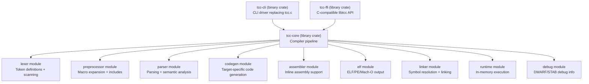

# Technical Specification

# 0. Agent Action Plan

## 0.1 Intent Clarification


### 0.1.1 Core Refactoring Objective

Based on the prompt, the Blitzy platform understands that the refactoring objective is to **migrate the Tiny C Compiler (TCC) codebase in its entirety from C to Rust** while preserving observable behavior, command-line compatibility, and the project's core value proposition of extreme compilation speed and minimal footprint.

- **Refactoring type**: Tech stack migration (C → Rust) with concurrent bug-fix integration
- **Target repository**: Same repository — Rust source replaces C source in-place; historical C sources are retained for reference per user instruction
- **Source project**: TinyCC v0.9.28rc, `mob` branch at `repo.or.cz`, LGPL-licensed, originally by Fabrice Bellard, maintained by community (grischka)
- **Codebase scale**: ~64,422 lines of C/H across root-level source files; 523 total files in repository; 6 architecture backends; 3 output format modules; 22-function public API (`libtcc.h`)

The refactoring goals, restated with enhanced clarity:

- **Goal 1 — Language Migration**: Port every compiler module (lexer, preprocessor, parser, code generator, assembler, linker, runtime) from C (ANSI C89/C90 with select C99) to idiomatic Rust using the stable toolchain, organized as a Cargo workspace with strong module boundaries
- **Goal 2 — Behavioral Preservation**: Maintain TCC's three core workflows — compile-only (`tcc -c file.c`), link-to-executable (`tcc -o out file.c`), and direct execution (`tcc -run file.c`) — with identical CLI invocation semantics for all documented flags (`-c`, `-o`, `-run`, `-I`, `-L`, `-l`, `-D`, `-U`, `-g`, `-b`, `-bt`, `-std`, `-fflag`, `-Wflag`, `-nostdinc`, `-nostdlib`, `-shared`, `-soname`, `-static`, `-rdynamic`, `-r`, `-Wl,`)
- **Goal 3 — Safety and Maintainability**: Eliminate classes of memory bugs (buffer overflows, use-after-free, null dereferences) inherent in the C codebase by leveraging Rust's ownership model, typed error handling (`Result<T, E>` with custom error enums via `thiserror`), and module-level encapsulation
- **Goal 4 — TODO Bug Resolution**: Address and resolve every single item listed in the `TODO` file (17 bugs, 3 portability items, 1 linking item, 4 bound-checking items, 6 missing features, 5 optimizations, 8 not-critical items) — with triage, reproduction, fix attempt, verification, and documented outcome for each; no item may be silently skipped

Implicit requirements surfaced:

- The Rust binary must produce **deterministic compiler output** matching the C baseline for valid programs
- The **libtcc API** (22 public functions defined in `libtcc.h`) must be preserved as a C-compatible FFI boundary so existing embedders can link against the Rust implementation
- The **self-hosting capability** (TCC compiling itself) is not required for the Rust port since the language has changed, but behavioral equivalence when compiling C programs is mandatory
- **Test suite compatibility**: The existing 127 `tests/tests2/` regression tests, 24 `tests/pp/` preprocessor tests, `tcctest.c` flagship driver, `abitest.c` ABI harness, `asmtest.S` assembly tests, and `boundtest.c` bounds-checking tests must all have equivalent Rust-side test coverage

### 0.1.2 Technical Interpretation

This refactoring translates to the following technical transformation strategy:

**Architecture Mapping — Current to Target:**

The current TCC architecture is a **monolithic single-pass compiler** with no intermediate representation, no abstract syntax tree, and no multi-pass optimization. It uses a pull-based tokenization model via a global `next()` function, a value stack (`SValue` array, 512-element depth) for expression evaluation, and direct code emission into ELF section buffers. The entire compiler compiles as a **single translation unit** via the `ONE_SOURCE` macro in `tcc.c`.

The target Rust architecture will be a **modular multi-crate workspace** that preserves TCC's single-pass compilation semantics while introducing clear module boundaries:



**Transformation Rules:**

- Every global mutable variable in `tcc.h` (token state `tok`, `tokc`; value stack `vstack`; current `TCCState`) becomes encapsulated state within Rust structs with explicit lifetimes
- All `setjmp`/`longjmp` error recovery is replaced by Rust's `Result`-based error propagation with custom error enums
- The `ONE_SOURCE` compilation model is replaced by Cargo workspace dependencies; each module remains tightly coupled for performance but gains clear interface boundaries
- Architecture-specific code (6 backends: i386, x86_64, ARM, ARM64, RISC-V64, C67) is implemented via Rust traits with per-architecture implementations
- Memory management shifts from manual `tcc_malloc`/`tcc_realloc`/`tcc_free` to Rust ownership; the custom `TinyAlloc` arena allocator is replaced by idiomatic Rust allocators where arena semantics are needed


## 0.2 Source Analysis


### 0.2.1 Comprehensive Source File Discovery

The complete TinyCC repository at `/tmp/blitzy/tinycc/mob_9a370e/` contains **523 total files** organized across the following functional areas. Every source file requiring migration is enumerated below — nothing is deferred or pending discovery.

**Compiler Core Source Files (root-level .c/.h — 64,422 lines total):**

| Source File | Lines | Role | Migration Module |
|------------|-------|------|-----------------|
| `tcc.c` | 428 | CLI driver, option parsing, `main()` entry | `tcc-cli` crate |
| `libtcc.c` | 2,272 | Compiler orchestration, `TCCState` management, file handling | `tcc-core` crate root |
| `tcc.h` | 2,016 | Master header — all shared types, structs, macros, globals | Distributed across Rust modules |
| `libtcc.h` | 128 | Public API (22 functions) | `tcc-ffi` crate |
| `tccpp.c` | 4,005 | Preprocessor — macro expansion, `#include`, `#define`, token scanning | `preprocessor` module |
| `tccgen.c` | 8,920 | Parser + code generator — expression evaluation, type system, codegen dispatch | `parser` + `codegen` modules |
| `tccasm.c` | 1,466 | Inline and standalone assembler | `assembler` module |
| `tccelf.c` | 4,116 | ELF object/executable output, symbol tables, relocations | `elf` module |
| `tccpe.c` | 2,114 | PE/COFF output for Windows targets | `pe` module |
| `tccmacho.c` | 2,476 | Mach-O output for macOS targets | `macho` module |
| `tccrun.c` | 1,556 | In-memory compilation and execution (`-run` mode) | `runtime` module |
| `tccdbg.c` | 2,676 | DWARF and STAB debug information generation | `debug` module |
| `tcctools.c` | 651 | Built-in `ar` and `tcc -ar` tool emulation | `tools` module |
| `tcccoff.c` | 951 | COFF output format (TMS320C67xx) | `coff` module |
| `tcctok.h` | 430 | Token definitions and keyword tables | `lexer` module |
| `conftest.c` | 308 | Build-time host detection (compiler, arch, OS) | Build script (`build.rs`) |

**Architecture Backend Files (21,811 lines total across 6 targets):**

| Target | Generator | Linker | Assembler | Token Header | Total Lines |
|--------|----------|--------|-----------|-------------|-------------|
| i386 | `i386-gen.c` (1,306) | `i386-link.c` (329) | `i386-asm.c` (1,757) | `i386-asm.h` (490), `i386-tok.h` (332) | 4,214 |
| x86_64 | `x86_64-gen.c` (2,313) | `x86_64-link.c` (410) | (shares `i386-asm.c`) | `x86_64-asm.h` (559) | 3,282 |
| ARM | `arm-gen.c` (2,385) | `arm-link.c` (445) | `arm-asm.c` (3,092) | `arm-tok.h` (406) | 6,328 |
| ARM64 | `arm64-gen.c` (2,209) | `arm64-link.c` (322) | `arm64-asm.c` (94) | — | 2,625 |
| RISC-V64 | `riscv64-gen.c` (1,434) | `riscv64-link.c` (419) | `riscv64-asm.c` (2,628) | `riscv64-tok.h` (490) | 4,971 |
| C67 (TMS320) | `c67-gen.c` (2,543) | `c67-link.c` (125) | — | — | 2,668 |
| IL (.NET) | `il-gen.c` (657) | — | — | `il-opcodes.h` (251) | 908 |

**Format/Structure Headers:**

| Header File | Lines | Purpose |
|------------|-------|---------|
| `elf.h` | 3,324 | ELF format type definitions |
| `dwarf.h` | 1,046 | DWARF debug format constants |
| `coff.h` | 446 | COFF format definitions |
| `stab.h` | 17 | STAB debug format |
| `stab.def` | — | STAB symbol definitions |
| `tcclib.h` | 80 | Minimal libc declarations for self-contained mode |

**Runtime Library (`lib/` — 18 files):**

| File | Purpose |
|------|---------|
| `lib/libtcc1.c` | 64-bit arithmetic helpers (`__udivdi3`, `__moddi3`, etc.) |
| `lib/alloca.S` | Stack-based dynamic allocation (x86/x86_64) |
| `lib/alloca-bt.S` | Alloca with backtrace support |
| `lib/bcheck.c` | Bounds-checking runtime |
| `lib/bt-exe.c` | Backtrace support for executables |
| `lib/bt-dll.c` | Backtrace support for DLLs |
| `lib/bt-log.c` | Backtrace logging |
| `lib/builtin.c` | `__builtin_ffs`, `__builtin_clz`, `__builtin_ctz`, `__builtin_popcount` |
| `lib/armeabi.c` | ARM EABI soft-float helpers |
| `lib/armflush.c` | ARM instruction cache flush |
| `lib/atomic.S` | Multi-architecture atomic operations |
| `lib/stdatomic.c` | C11 `<stdatomic.h>` support |
| `lib/runmain.c` | Constructor/destructor handling for `-run` mode |
| `lib/dsohandle.c` | `__dso_handle` symbol for shared libraries |
| `lib/lib-arm64.c` | ARM64-specific runtime helpers |
| `lib/tcov.c` | Test coverage instrumentation |
| `lib/pic86.S` | x86 PIC (position-independent code) support |
| `lib/Makefile` | Runtime library build orchestration |

**Standard Include Headers (`include/` — 10 files):**

`include/float.h`, `include/stdalign.h`, `include/stdarg.h`, `include/stdatomic.h`, `include/stdbool.h`, `include/stddef.h`, `include/stdnoreturn.h`, `include/tccdefs.h` (foundational predefs — 756 lines), `include/tgmath.h`, `include/varargs.h`

**Test Suite (`tests/` — 327 files):**

- `tests/tcctest.c` — Flagship regression driver (hundreds of test cases)
- `tests/abitest.c` — ABI compatibility harness using libtcc
- `tests/asmtest.S` — Comprehensive x86/x86_64 assembly tests
- `tests/boundtest.c` — 18 out-of-bounds checking test cases
- `tests/Makefile` — Test orchestration (hello-exe, hello-run, libtest, abitest, vla_test, tests2-dir, pp-dir)
- `tests/tests2/` — 127 numbered test programs (`00_assignment.c` through `137_funcall_struct_args.c`) with matching `.expect` files
- `tests/pp/` — 24 preprocessor regression fixtures (`01.c` through `pp-counter.c`) with matching `.expect` files

**Windows Support (`win32/` — 103 files):**

- `win32/build-tcc.bat` — Master Windows build script
- `win32/tcc-win32.txt` — Windows user guide
- `win32/include/` — MinGW-w64 compatibility headers (winapi, CRT, POSIX shims)
- `win32/lib/` — CRT startup files (`crt1.c`, `dllcrt1.c`, `wincrt1.c`), import `.def` files, `chkstk.S`
- `win32/examples/` — 4 Windows-specific examples

**Build and Project Files:**

`configure` (custom shell script), `Makefile`, `VERSION` (0.9.28rc), `README`, `COPYING` (LGPL), `RELICENSING`, `Changelog`, `CodingStyle`, `USES`, `TODO`, `.gitignore`, `.github/workflows/build.yml`

### 0.2.2 Current Structure Mapping

```
Current:
/tmp/blitzy/tinycc/mob_9a370e/
├── tcc.c                    (428 lines - CLI driver, to be replaced)
├── libtcc.c                 (2,272 lines - orchestration, to be rewritten)
├── libtcc.h                 (128 lines - public API, to be FFI-wrapped)
├── tcc.h                    (2,016 lines - monolithic header, to be decomposed)
├── tccpp.c                  (4,005 lines - preprocessor, to be ported)
├── tccgen.c                 (8,920 lines - parser+codegen, to be split and ported)
├── tccasm.c                 (1,466 lines - assembler, to be ported)
├── tccelf.c                 (4,116 lines - ELF backend, to be ported)
├── tccpe.c                  (2,114 lines - PE backend, to be ported)
├── tccmacho.c               (2,476 lines - Mach-O backend, to be ported)
├── tccrun.c                 (1,556 lines - runtime execution, to be ported)
├── tccdbg.c                 (2,676 lines - debug info, to be ported)
├── tcctools.c               (651 lines - ar tool, to be ported)
├── tcccoff.c                (951 lines - COFF output, to be ported)
├── tcctok.h                 (430 lines - token defs, to be ported)
├── conftest.c               (308 lines - build detection, to become build.rs)
├── elf.h                    (3,324 lines - ELF types, to use `object` crate)
├── dwarf.h / coff.h / stab.h  (format headers, to use Rust crate equivalents)
├── {arch}-gen.c             (6 files - backend generators, to be trait impls)
├── {arch}-link.c            (6 files - backend linkers, to be trait impls)
├── {arch}-asm.c             (4 files - backend assemblers, to be trait impls)
├── {arch}-tok.h / {arch}-asm.h  (token/asm headers, to be Rust enums)
├── il-gen.c / il-opcodes.h  (IL/.NET backend, to be ported)
├── configure                (shell script - replaced by Cargo build)
├── Makefile                 (GNU Make - replaced by Cargo)
├── lib/                     (18 files - runtime library, retained as-is for compiled output)
├── include/                 (10 files - standard headers, retained as-is for compiled output)
├── tests/                   (327 files - test suite, to be adapted)
├── win32/                   (103 files - Windows support, retained and adapted)
├── examples/                (5 files - retained as-is)
├── TODO                     (bug/feature tracking - to be triaged)
├── VERSION / README / COPYING / Changelog / CodingStyle / USES / RELICENSING
└── .github/workflows/build.yml  (CI, to be updated for Rust)
```


## 0.3 Scope Boundaries


### 0.3.1 Exhaustively In Scope

**Source Transformations (C → Rust migration of all compiler modules):**

- `tcc.c` — CLI driver, option parsing, `main()` → Rust `tcc-cli` binary crate
- `libtcc.c` — Compiler orchestration, `TCCState` lifecycle → Rust `tcc-core` library crate
- `tcc.h` — Monolithic shared header → Distributed Rust module types
- `libtcc.h` — Public C API (22 functions) → Rust `tcc-ffi` crate with `#[no_mangle] extern "C"` exports
- `tccpp.c` — Preprocessor → `tcc-core::preprocessor` module
- `tccgen.c` — Parser + code generation → `tcc-core::parser` + `tcc-core::codegen` modules
- `tccasm.c` — Assembler → `tcc-core::assembler` module
- `tccelf.c` — ELF output → `tcc-core::elf` module
- `tccpe.c` — PE/COFF output → `tcc-core::pe` module
- `tccmacho.c` — Mach-O output → `tcc-core::macho` module
- `tccrun.c` — Runtime execution → `tcc-core::runtime` module
- `tccdbg.c` — Debug info generation → `tcc-core::debug` module
- `tcctools.c` — Built-in `ar` tool → `tcc-core::tools` module
- `tcccoff.c` — COFF output → `tcc-core::coff` module
- `tcctok.h` — Token definitions → `tcc-core::lexer` module (Rust enums)
- `conftest.c` — Host detection → `build.rs` build script
- `i386-gen.c`, `i386-link.c`, `i386-asm.c`, `i386-asm.h`, `i386-tok.h` — i386 backend
- `x86_64-gen.c`, `x86_64-link.c`, `x86_64-asm.h` — x86_64 backend
- `arm-gen.c`, `arm-link.c`, `arm-asm.c`, `arm-tok.h` — ARM backend
- `arm64-gen.c`, `arm64-link.c`, `arm64-asm.c` — ARM64 backend
- `riscv64-gen.c`, `riscv64-link.c`, `riscv64-asm.c`, `riscv64-tok.h` — RISC-V64 backend
- `c67-gen.c`, `c67-link.c` — C67 (TMS320) backend
- `il-gen.c`, `il-opcodes.h` — IL/.NET backend

**Test Suite Updates:**

- `tests/Makefile` — Adapt for Rust test runner invocation
- `tests/tcctest.c` — Equivalent compatibility test in Rust harness
- `tests/abitest.c` — ABI compatibility verification via Rust FFI harness
- `tests/asmtest.S` — Assembly test validation
- `tests/boundtest.c` — Bounds checking regression
- `tests/tests2/*.c` + `tests/tests2/*.expect` — All 127 regression tests adapted to Rust test harness
- `tests/pp/*.c` + `tests/pp/*.expect` — All 24 preprocessor regression tests

**Configuration Updates:**

- `configure` → Replaced by `Cargo.toml` workspace configuration + `build.rs`
- `Makefile` → Replaced by `cargo build` / `cargo test` workflow
- `.github/workflows/build.yml` → Updated for Rust CI (rustup, cargo build, cargo test)
- `VERSION` → Embedded in `Cargo.toml` package version field

**Documentation Updates:**

- `README` → Updated with Rust build/test/install instructions
- `TODO` → Fully triaged; outcomes documented in `docs/todo_bug_status.md`
- New: `docs/migration_plan.md` — Phase plan + C-to-Rust module mapping
- New: `docs/compatibility_report.md` — Behavioral equivalence documentation
- New: `docs/todo_bug_status.md` — TODO triage and fix tracking matrix
- New: `docs/todo_full_coverage_matrix.md` — Row-per-TODO-item full coverage
- New: `README.bug-repros.md` — User-facing bug reproduction and verification guide

**Import/Reference Corrections:**

- Every Rust source file using cross-module references
- All `use` and `mod` declarations in the Cargo workspace
- FFI boundary exports matching `libtcc.h` signatures

### 0.3.2 Explicitly Out of Scope

Per the user's directives, the following are explicitly out of scope:

- **Historical C source files**: The original `.c` and `.h` files are retained in the repository for reference; they are NOT deleted or modified
- **Licensing/copyright files**: `COPYING`, `RELICENSING` remain unchanged
- **Runtime library source files**: `lib/*.c`, `lib/*.S`, `lib/Makefile` — These are compiled *by* TCC (not part of TCC itself) and are shipped as-is for the Rust binary to compile into targets; they remain C/assembly
- **Standard include headers**: `include/*.h` — These are provided to user programs compiled by TCC; they remain as-is
- **Win32 include/lib headers**: `win32/include/**`, `win32/lib/**` — These are for Windows target compilation; they remain as-is
- **Example programs**: `examples/ex1.c` through `examples/ex5.c` — These are user-facing C programs; they remain as-is and serve as compatibility test inputs
- **Unrelated optimizations/features**: Per the minimal change clause, no new features, performance optimizations, or architectural improvements beyond what is explicitly required for the C→Rust migration and TODO bug resolution
- **Behavior changes**: No changes to observable compiler behavior unless explicitly required to fix a documented TODO bug; all differences from baseline must be documented in `docs/compatibility_report.md`
- **C++ support**: Listed in TODO as "not critical" — remains deferred
- **PowerPC code generator**: Listed in TODO as "not critical" — remains deferred unless directly impacted by migration


## 0.4 Target Design


### 0.4.1 Refactored Structure Planning

The target architecture is a Cargo workspace with three crates and a comprehensive module hierarchy. Every file and folder required for standalone operation is listed explicitly below.

```
Target:
tinycc/
├── Cargo.toml                          (workspace root manifest)
├── rust-toolchain.toml                 (pins stable Rust 1.94.x)
├── README.md                           (updated build/test/install instructions)
├── README.bug-repros.md                (user-facing bug reproduction guide)
├── COPYING                             (retained, unchanged)
├── RELICENSING                         (retained, unchanged)
├── Changelog                           (retained, updated with migration notes)
├── CodingStyle                         (retained for reference)
├── USES                                (retained)
├── VERSION                             (retained for reference)
├── TODO                                (retained for reference, triaged)
│
├── docs/
│   ├── migration_plan.md               (C→Rust module mapping + phase plan)
│   ├── compatibility_report.md         (behavioral equivalence documentation)
│   ├── todo_bug_status.md              (TODO triage and fix tracking)
│   └── todo_full_coverage_matrix.md    (row-per-item full coverage matrix)
│
├── crates/
│   ├── tcc-cli/
│   │   ├── Cargo.toml                  (binary crate, depends on tcc-core)
│   │   └── src/
│   │       └── main.rs                 (CLI entry point, option parsing)
│   │
│   ├── tcc-core/
│   │   ├── Cargo.toml                  (library crate, compiler pipeline)
│   │   ├── build.rs                    (host detection, replaces conftest.c)
│   │   └── src/
│   │       ├── lib.rs                  (crate root, TCCState, public interface)
│   │       ├── error.rs                (TccError enum, Result type alias)
│   │       ├── types.rs                (CType, SValue, Sym, Section, shared types from tcc.h)
│   │       ├── token.rs                (Token enum, keyword tables from tcctok.h)
│   │       ├── lexer.rs                (character scanning, token production)
│   │       ├── preprocessor.rs         (macro expansion, #include, #define — from tccpp.c)
│   │       ├── parser.rs               (expression parsing, statement parsing — from tccgen.c top half)
│   │       ├── codegen.rs              (code generation dispatch, value stack — from tccgen.c bottom half)
│   │       ├── assembler.rs            (inline/standalone asm — from tccasm.c)
│   │       ├── elf.rs                  (ELF output, sections, symbols — from tccelf.c)
│   │       ├── pe.rs                   (PE/COFF output — from tccpe.c)
│   │       ├── macho.rs                (Mach-O output — from tccmacho.c)
│   │       ├── coff.rs                 (COFF output — from tcccoff.c)
│   │       ├── runtime.rs              (in-memory execution — from tccrun.c)
│   │       ├── debug.rs                (DWARF/STAB debug info — from tccdbg.c)
│   │       ├── tools.rs                (built-in ar — from tcctools.c)
│   │       ├── alloc.rs                (arena allocator replacing TinyAlloc)
│   │       ├── config.rs               (build-time config constants)
│   │       └── arch/
│   │           ├── mod.rs              (CodegenBackend trait definition)
│   │           ├── i386/
│   │           │   ├── mod.rs
│   │           │   ├── gen.rs          (from i386-gen.c)
│   │           │   ├── link.rs         (from i386-link.c)
│   │           │   ├── asm.rs          (from i386-asm.c)
│   │           │   └── tokens.rs       (from i386-tok.h + i386-asm.h)
│   │           ├── x86_64/
│   │           │   ├── mod.rs
│   │           │   ├── gen.rs          (from x86_64-gen.c)
│   │           │   ├── link.rs         (from x86_64-link.c)
│   │           │   └── tokens.rs       (from x86_64-asm.h)
│   │           ├── arm/
│   │           │   ├── mod.rs
│   │           │   ├── gen.rs          (from arm-gen.c)
│   │           │   ├── link.rs         (from arm-link.c)
│   │           │   ├── asm.rs          (from arm-asm.c)
│   │           │   └── tokens.rs       (from arm-tok.h)
│   │           ├── arm64/
│   │           │   ├── mod.rs
│   │           │   ├── gen.rs          (from arm64-gen.c)
│   │           │   ├── link.rs         (from arm64-link.c)
│   │           │   └── asm.rs          (from arm64-asm.c)
│   │           ├── riscv64/
│   │           │   ├── mod.rs
│   │           │   ├── gen.rs          (from riscv64-gen.c)
│   │           │   ├── link.rs         (from riscv64-link.c)
│   │           │   ├── asm.rs          (from riscv64-asm.c)
│   │           │   └── tokens.rs       (from riscv64-tok.h)
│   │           ├── c67/
│   │           │   ├── mod.rs
│   │           │   ├── gen.rs          (from c67-gen.c)
│   │           │   └── link.rs         (from c67-link.c)
│   │           └── il/
│   │               ├── mod.rs
│   │               └── gen.rs          (from il-gen.c + il-opcodes.h)
│   │
│   └── tcc-ffi/
│       ├── Cargo.toml                  (library crate, C-compatible FFI)
│       └── src/
│           └── lib.rs                  (extern "C" fn wrappers for all 22 libtcc API functions)
│
├── lib/                                (retained as-is — TCC runtime library)
│   ├── Makefile
│   ├── libtcc1.c
│   ├── alloca.S / alloca-bt.S
│   ├── bcheck.c
│   ├── bt-exe.c / bt-dll.c / bt-log.c
│   ├── builtin.c
│   ├── armeabi.c / armflush.c
│   ├── atomic.S
│   ├── stdatomic.c
│   ├── runmain.c / dsohandle.c
│   ├── lib-arm64.c
│   ├── tcov.c
│   └── pic86.S
│
├── include/                            (retained as-is — standard headers for compiled programs)
│   ├── float.h / stdalign.h / stdarg.h / stdatomic.h
│   ├── stdbool.h / stddef.h / stdnoreturn.h
│   ├── tccdefs.h / tgmath.h / varargs.h
│
├── win32/                              (retained as-is — Windows support files)
│   ├── build-tcc.bat
│   ├── tcc-win32.txt
│   ├── include/ (full MinGW-w64 header set)
│   ├── lib/ (CRT startup, .def files)
│   └── examples/
│
├── examples/                           (retained as-is — user-facing C examples)
│   ├── ex1.c through ex5.c
│
├── tests/
│   ├── Makefile                        (updated for Rust test runner)
│   ├── tcctest.c                       (retained as test input)
│   ├── abitest.c                       (retained as test input)
│   ├── asmtest.S                       (retained as test input)
│   ├── boundtest.c                     (retained as test input)
│   ├── tests2/                         (127 tests retained as input)
│   ├── pp/                             (24 tests retained as input)
│   └── rust/                           (new directory)
│       ├── integration_tests.rs        (Rust integration test runner)
│       ├── compatibility_tests.rs      (C-baseline vs Rust output comparison)
│       └── regression_tests.rs         (per-TODO-bug regression tests)
│
├── .github/workflows/
│   └── build.yml                       (updated for Rust CI)
│
└── .gitignore                          (updated for Cargo target/ directory)
```

### 0.4.2 Web Search Research Conducted

Research was conducted to inform the target design:

- **Rust stable toolchain**: Current stable is Rust 1.94.1 (as of April 2026); project will target `stable` channel via `rust-toolchain.toml`
- **CLI argument parsing in Rust**: `clap` 4.6.0 is the standard crate for building CLI parsers with derive macros; justified for replicating TCC's complex option parsing
- **Typed error handling**: `thiserror` 2.0.18 provides derive macros for `std::error::Error` implementations; replaces `setjmp`/`longjmp` error recovery
- **Cranelift code generation framework**: Evaluated but **not adopted** — Cranelift introduces its own IR and is designed for different compilation models; TCC's direct-to-machine-code single-pass approach does not align with Cranelift's multi-pass pipeline. The Rust port will retain TCC's direct code emission model.
- **ELF/object file handling**: The `object` crate provides Rust-native ELF/PE/Mach-O reading and writing; may be used to supplement or validate TCC's own object emission code

### 0.4.3 Design Pattern Applications

The following design patterns will be applied to structure the Rust implementation:

- **Trait-based backend abstraction**: A `CodegenBackend` trait defines the interface for architecture-specific code generation (`gen_op`, `gen_func_prologue`, `gen_func_epilogue`, `gen_load`, `gen_store`, `gen_call`, `gen_jump`, `gen_reloc`); each architecture crate implements this trait
- **Builder pattern for TCCState**: The central compiler state is constructed via a builder that enforces required configuration before compilation begins (output type must be set before adding files)
- **Result-based error propagation**: All fallible operations return `Result<T, TccError>` where `TccError` is a comprehensive enum covering lexer, preprocessor, parser, codegen, linker, and I/O errors — replacing the C codebase's mix of `longjmp`, `return -1`, and `tcc_error()` calls
- **Module encapsulation**: Global mutable state from `tcc.h` (token hash table, value stack, include cache, symbol pools) is encapsulated within Rust structs with controlled access through methods, eliminating the implicit coupling that exists in the C codebase
- **Feature flags for optional backends**: Architecture backends are enabled/disabled via Cargo features (e.g., `features = ["x86_64", "arm", "arm64", "riscv64"]`) rather than compile-time `#ifdef` guards

### 0.4.4 User Interface Design

Not applicable — TCC is a command-line compiler with no graphical user interface. The CLI contract is the sole user interface and is documented in Section 0.1.1 (all supported flags preserved).


## 0.5 Transformation Mapping


### 0.5.1 File-by-File Transformation Plan

Every target file is mapped to a source file. The transformation modes are:
- **CREATE** — New Rust file created from a C source file (C→Rust port)
- **UPDATE** — Existing file modified in place
- **REFERENCE** — Source file used as a pattern/reference for the new file

**Workspace Configuration Files:**

| Target File | Transformation | Source File | Key Changes |
|------------|---------------|-------------|-------------|
| `Cargo.toml` | CREATE | `Makefile`, `configure` | Workspace root with members `crates/tcc-cli`, `crates/tcc-core`, `crates/tcc-ffi`; workspace-level dependency declarations |
| `rust-toolchain.toml` | CREATE | — | Pin `channel = "stable"` for reproducible builds |
| `.gitignore` | UPDATE | `.gitignore` | Add `target/`, `Cargo.lock` patterns; retain existing C build artifact patterns |
| `.github/workflows/build.yml` | UPDATE | `.github/workflows/build.yml` | Replace `configure/make/make test` with `rustup/cargo build --release/cargo test`; retain multi-platform matrix (Linux x86_64, macOS Intel/ARM, Windows) |

**CLI Crate (`crates/tcc-cli/`):**

| Target File | Transformation | Source File | Key Changes |
|------------|---------------|-------------|-------------|
| `crates/tcc-cli/Cargo.toml` | CREATE | — | Binary crate manifest; depends on `tcc-core`, `clap` for argument parsing |
| `crates/tcc-cli/src/main.rs` | CREATE | `tcc.c` | Port CLI driver: option parsing for all flags (`-c`, `-o`, `-run`, `-I`, `-L`, `-l`, `-D`, `-U`, `-g`, `-b`, `-bt`, `-std`, `-f`, `-W`, `-nostdinc`, `-nostdlib`, `-shared`, `-soname`, `-static`, `-rdynamic`, `-r`, `-Wl,`, `-bench`, `-E`), help text, `main()` orchestration calling `tcc-core` |

**Core Compiler Crate (`crates/tcc-core/`):**

| Target File | Transformation | Source File | Key Changes |
|------------|---------------|-------------|-------------|
| `crates/tcc-core/Cargo.toml` | CREATE | — | Library crate manifest; optional features per architecture backend; depends on `thiserror` |
| `crates/tcc-core/build.rs` | CREATE | `conftest.c` | Host compiler/arch/OS detection at build time; set `cfg` flags for target arch |
| `crates/tcc-core/src/lib.rs` | CREATE | `libtcc.c` | Crate root: `TCCState` struct, `tcc_new()`/`tcc_delete()` lifecycle, `tcc_add_file()`, `tcc_compile_string()`, `tcc_set_output_type()`, `tcc_output_file()`, `tcc_run()`, `tcc_relocate()`, `tcc_get_symbol()`; module declarations |
| `crates/tcc-core/src/error.rs` | CREATE | `tcc.h` (error macros) | `TccError` enum with variants: `LexerError`, `PreprocessorError`, `ParseError`, `CodegenError`, `LinkerError`, `IoError`, `AsmError`; implements `thiserror::Error` |
| `crates/tcc-core/src/types.rs` | CREATE | `tcc.h` | Port `CType`, `SValue`, `Sym`, `Section`, `BufferedFile`, `TokenSym`, `AttributeDef` structs; port `#define` constants for types (`VT_INT`, `VT_BYTE`, `VT_SHORT`, `VT_VOID`, `VT_PTR`, `VT_FUNC`, `VT_STRUCT`, `VT_FLOAT`, `VT_DOUBLE`, `VT_LDOUBLE`, `VT_BOOL`, etc.) |
| `crates/tcc-core/src/token.rs` | CREATE | `tcctok.h` | Port all token definitions as Rust enums; keyword table; operator precedence tables |
| `crates/tcc-core/src/lexer.rs` | CREATE | `tccpp.c` (scanning portion) | Character-level scanning, number/string literal parsing, token production |
| `crates/tcc-core/src/preprocessor.rs` | CREATE | `tccpp.c` | Macro definition/expansion, `#include` resolution, `#if`/`#ifdef`/`#elif`/`#else`/`#endif`, `#line`, `#pragma`, `#error`, `__FILE__`, `__LINE__`, `__DATE__`, `__TIME__`, `__COUNTER__`, token pasting (`##`), stringification (`#`) |
| `crates/tcc-core/src/parser.rs` | CREATE | `tccgen.c` (top half) | Expression parsing, statement parsing, declaration parsing, type checking, scope management; replaces global `tok`/`tokc` state with parser struct |
| `crates/tcc-core/src/codegen.rs` | CREATE | `tccgen.c` (bottom half) | Code generation dispatch, value stack (`SValue`) management, `gen_op()`, `gen_cast()`, expression-to-instruction translation; dispatches to architecture backends via `CodegenBackend` trait |
| `crates/tcc-core/src/assembler.rs` | CREATE | `tccasm.c` | GAS-syntax inline assembly (`.globl`, `.text`, `.data`, labels, directives); standalone assembler mode |
| `crates/tcc-core/src/elf.rs` | CREATE | `tccelf.c`, `elf.h` | ELF section management, symbol table construction, relocation processing, executable/shared-library output; port ELF type definitions or use `object` crate types |
| `crates/tcc-core/src/pe.rs` | CREATE | `tccpe.c` | PE/COFF executable/DLL output for Windows targets; import/export tables, resource sections |
| `crates/tcc-core/src/macho.rs` | CREATE | `tccmacho.c` | Mach-O output for macOS; load commands, segments, sections |
| `crates/tcc-core/src/coff.rs` | CREATE | `tcccoff.c`, `coff.h` | COFF output for TMS320C67xx targets |
| `crates/tcc-core/src/runtime.rs` | CREATE | `tccrun.c` | In-memory compilation and execution; memory mapping, symbol resolution for `-run` mode |
| `crates/tcc-core/src/debug.rs` | CREATE | `tccdbg.c`, `dwarf.h`, `stab.h` | DWARF debug info generation, STAB support, line number tables, scope tracking |
| `crates/tcc-core/src/tools.rs` | CREATE | `tcctools.c` | Built-in `ar` archive creation (`tcc -ar`); nm-like symbol listing |
| `crates/tcc-core/src/alloc.rs` | CREATE | `tcc.h` (TinyAlloc) | Arena allocator for temporary compilation data; replaces `tcc_malloc`/`tcc_realloc`/`tcc_free` |
| `crates/tcc-core/src/config.rs` | CREATE | `tcc.h` (CONFIG_* defines) | Build-time constants: `CONFIG_TCCDIR`, `CONFIG_TCC_SYSINCLUDEPATHS`, `CONFIG_TCC_LIBPATHS`, `CONFIG_TCC_CRTPREFIX`, `CONFIG_TCC_ELFINTERP` |

**Architecture Backends:**

| Target File | Transformation | Source File | Key Changes |
|------------|---------------|-------------|-------------|
| `crates/tcc-core/src/arch/mod.rs` | CREATE | `tcc.h` (arch dispatch macros) | `CodegenBackend` trait: `gen_le()`, `gen_opi()`, `gen_opf()`, `gen_cvt_ftoi()`, `gen_cvt_itof()`, `gen_vla_sp_save()`, `gen_func_prologue()`, `gen_func_epilogue()`, `gen_fill_nops()` etc.; arch selection logic |
| `crates/tcc-core/src/arch/i386/mod.rs` | CREATE | `i386-gen.c` | Module root; `I386Backend` struct implementing `CodegenBackend` |
| `crates/tcc-core/src/arch/i386/gen.rs` | CREATE | `i386-gen.c` (1,306 lines) | Register allocation, instruction emission, calling convention, stack frame management |
| `crates/tcc-core/src/arch/i386/link.rs` | CREATE | `i386-link.c` (329 lines) | Relocation types, PLT/GOT generation, symbol binding |
| `crates/tcc-core/src/arch/i386/asm.rs` | CREATE | `i386-asm.c` (1,757 lines) | x86 instruction encoding, operand parsing, opcode tables |
| `crates/tcc-core/src/arch/i386/tokens.rs` | CREATE | `i386-tok.h`, `i386-asm.h` | Register names, instruction mnemonics as Rust enums |
| `crates/tcc-core/src/arch/x86_64/mod.rs` | CREATE | `x86_64-gen.c` | Module root; `X86_64Backend` struct implementing `CodegenBackend` |
| `crates/tcc-core/src/arch/x86_64/gen.rs` | CREATE | `x86_64-gen.c` (2,313 lines) | 64-bit register allocation, System V / Win64 ABI, REX prefix handling |
| `crates/tcc-core/src/arch/x86_64/link.rs` | CREATE | `x86_64-link.c` (410 lines) | x86_64-specific relocation types, large code model support |
| `crates/tcc-core/src/arch/x86_64/tokens.rs` | CREATE | `x86_64-asm.h` (559 lines) | Extended register names, 64-bit instruction mnemonics |
| `crates/tcc-core/src/arch/arm/mod.rs` | CREATE | `arm-gen.c` | Module root; `ArmBackend` struct |
| `crates/tcc-core/src/arch/arm/gen.rs` | CREATE | `arm-gen.c` (2,385 lines) | ARM instruction emission, Thumb support, VFP/NEON |
| `crates/tcc-core/src/arch/arm/link.rs` | CREATE | `arm-link.c` (445 lines) | ARM relocation types, PLT generation |
| `crates/tcc-core/src/arch/arm/asm.rs` | CREATE | `arm-asm.c` (3,092 lines) | ARM/Thumb assembly encoding |
| `crates/tcc-core/src/arch/arm/tokens.rs` | CREATE | `arm-tok.h` (406 lines) | ARM register names, condition codes |
| `crates/tcc-core/src/arch/arm64/mod.rs` | CREATE | `arm64-gen.c` | Module root; `Arm64Backend` struct |
| `crates/tcc-core/src/arch/arm64/gen.rs` | CREATE | `arm64-gen.c` (2,209 lines) | AArch64 instruction emission, AAPCS64 calling convention |
| `crates/tcc-core/src/arch/arm64/link.rs` | CREATE | `arm64-link.c` (322 lines) | AArch64 relocation types |
| `crates/tcc-core/src/arch/arm64/asm.rs` | CREATE | `arm64-asm.c` (94 lines) | Minimal AArch64 assembly support |
| `crates/tcc-core/src/arch/riscv64/mod.rs` | CREATE | `riscv64-gen.c` | Module root; `Riscv64Backend` struct |
| `crates/tcc-core/src/arch/riscv64/gen.rs` | CREATE | `riscv64-gen.c` (1,434 lines) | RISC-V instruction emission, RV64GC encoding |
| `crates/tcc-core/src/arch/riscv64/link.rs` | CREATE | `riscv64-link.c` (419 lines) | RISC-V relocation types, linker relaxation |
| `crates/tcc-core/src/arch/riscv64/asm.rs` | CREATE | `riscv64-asm.c` (2,628 lines) | RISC-V assembly encoding |
| `crates/tcc-core/src/arch/riscv64/tokens.rs` | CREATE | `riscv64-tok.h` (490 lines) | RISC-V register names, CSRs |
| `crates/tcc-core/src/arch/c67/mod.rs` | CREATE | `c67-gen.c` | Module root; `C67Backend` struct |
| `crates/tcc-core/src/arch/c67/gen.rs` | CREATE | `c67-gen.c` (2,543 lines) | TMS320C67xx instruction emission |
| `crates/tcc-core/src/arch/c67/link.rs` | CREATE | `c67-link.c` (125 lines) | C67 relocation types |
| `crates/tcc-core/src/arch/il/mod.rs` | CREATE | `il-gen.c` | Module root; `IlBackend` struct |
| `crates/tcc-core/src/arch/il/gen.rs` | CREATE | `il-gen.c` (657 lines), `il-opcodes.h` (251 lines) | .NET IL bytecode emission |

**FFI Crate (`crates/tcc-ffi/`):**

| Target File | Transformation | Source File | Key Changes |
|------------|---------------|-------------|-------------|
| `crates/tcc-ffi/Cargo.toml` | CREATE | — | Library crate (cdylib + staticlib); depends on `tcc-core` |
| `crates/tcc-ffi/src/lib.rs` | CREATE | `libtcc.h` | `extern "C"` wrappers for all 22 public API functions: `tcc_set_realloc`, `tcc_new`, `tcc_delete`, `tcc_set_lib_path`, `tcc_set_error_func`, `tcc_set_options`, `tcc_add_include_path`, `tcc_add_sysinclude_path`, `tcc_define_symbol`, `tcc_undefine_symbol`, `tcc_add_file`, `tcc_compile_string`, `tcc_set_output_type`, `tcc_add_library_path`, `tcc_add_library`, `tcc_add_symbol`, `tcc_output_file`, `tcc_run`, `tcc_relocate`, `tcc_get_symbol`, `tcc_list_symbols`, plus advanced/debug functions (`tcc_setjmp`, `tcc_compile_string_file`, `elf_output_obj`, `tcc_set_backtrace_func`) |

**Documentation Files:**

| Target File | Transformation | Source File | Key Changes |
|------------|---------------|-------------|-------------|
| `README.md` | UPDATE | `README` | Rust build/test/install instructions; preserve TCC feature description; add Cargo commands |
| `README.bug-repros.md` | CREATE | `TODO` | Environment prerequisites, per-bug reproduction steps, before/after verification commands |
| `docs/migration_plan.md` | CREATE | — | Phase plan, C-file-to-Rust-module traceability matrix |
| `docs/compatibility_report.md` | CREATE | — | What is equivalent, what differs, why; test evidence |
| `docs/todo_bug_status.md` | CREATE | `TODO` | Per-item triage: category, reproduction, fix, status, evidence |
| `docs/todo_full_coverage_matrix.md` | CREATE | `TODO` | Tabular matrix with every line item from TODO |

**Test Files:**

| Target File | Transformation | Source File | Key Changes |
|------------|---------------|-------------|-------------|
| `tests/Makefile` | UPDATE | `tests/Makefile` | Add Rust test invocation targets alongside existing C test targets |
| `tests/rust/integration_tests.rs` | CREATE | `tests/Makefile` (test definitions) | Rust integration test runner invoking compiled `tcc` binary against `tests/tests2/*.c`, `tests/pp/*.c` with diff-based `.expect` validation |
| `tests/rust/compatibility_tests.rs` | CREATE | `tests/tcctest.c`, `tests/abitest.c` | Automated comparison of Rust TCC output vs C TCC baseline output |
| `tests/rust/regression_tests.rs` | CREATE | `TODO` | Per-TODO-bug regression test with reproduction and verification |

### 0.5.2 Cross-File Dependencies

**Import Statement Updates:**

The C codebase uses a monolithic `#include "tcc.h"` in every file, which pulls in all shared state. The Rust port replaces this with explicit, scoped imports:

- FROM: `#include "tcc.h"` (implicit access to ~2,016 lines of declarations)
- TO: `use crate::types::{CType, SValue, Sym, Section};` + `use crate::token::Token;` + `use crate::error::TccResult;` (explicit, minimal imports per module)

- FROM: `#include "tcctok.h"` (embedded in tccpp.c via `DEF()` macro)
- TO: `use crate::token::{Token, Keyword, KEYWORDS};` (Rust enum with generated lookup table)

- FROM: `#include "i386-asm.h"` / `#include "x86_64-asm.h"` (architecture-specific inline includes)
- TO: `use crate::arch::x86_64::tokens::{X86Register, X86Instruction};` (typed enums per backend)

**Configuration Updates for New Structure:**

- `Cargo.toml` workspace root declares workspace members and shared dependency versions
- Each crate's `Cargo.toml` declares only its direct dependencies
- `build.rs` in `tcc-core` replaces `configure` + `conftest.c` for host detection
- Feature flags in `tcc-core/Cargo.toml` replace `#ifdef TCC_TARGET_*` compile-time guards

**Test File Import Corrections:**

- Integration tests import the compiled `tcc` binary by path (`Command::new("target/release/tcc")`)
- Unit tests within `tcc-core` use `#[cfg(test)] mod tests` with direct access to internal APIs
- FFI tests link against `libtcc` shared/static library produced by `tcc-ffi`

### 0.5.3 Wildcard Patterns

Wildcard patterns are used only where necessary and always with trailing patterns:

- `crates/tcc-core/src/arch/*/mod.rs` — All architecture backend module roots
- `crates/tcc-core/src/arch/*/gen.rs` — All architecture code generators
- `crates/tcc-core/src/arch/*/link.rs` — All architecture linker modules
- `crates/tcc-core/src/arch/*/asm.rs` — Architecture assembler modules (where applicable)
- `crates/tcc-core/src/arch/*/tokens.rs` — Architecture token/register definitions (where applicable)
- `tests/tests2/*.c` — All regression test inputs (retained, used by Rust test harness)
- `tests/tests2/*.expect` — All expected output files (retained, used by Rust test harness)
- `tests/pp/*.c` — All preprocessor test inputs (retained)
- `tests/pp/*.expect` — All preprocessor expected outputs (retained)
- `docs/*.md` — All documentation deliverables

### 0.5.4 One-Phase Execution

The entire refactor is executed by Blitzy in **ONE phase**. All files listed in the transformation tables above are created/updated in a single unified execution. There is no phase splitting, no incremental migration, and no partial deliveries. The workspace must compile and pass all tests as a complete unit upon delivery.


## 0.6 Dependency Inventory


### 0.6.1 Key Private and Public Packages

The user specifies "prefer std + minimal crates" with any crate usage justified. The following packages are identified as necessary for the Rust implementation:

**Rust Toolchain:**

| Registry | Name | Version | Purpose |
|----------|------|---------|---------|
| rustup | Rust stable toolchain | 1.94.1 | Primary language runtime and compiler |
| rustup | Cargo | (bundled with Rust 1.94.1) | Build system and package manager |

**Crate Dependencies (workspace-level):**

| Registry | Crate | Version | Crate Type | Purpose | Justification |
|----------|-------|---------|------------|---------|---------------|
| crates.io | `clap` | 4.6.0 | Public | CLI argument parsing with derive macros | TCC has ~50+ CLI flags with complex semantics (flag grouping, `-Wl,` passthrough, `-f`/`-W` prefix families); manual parsing would be error-prone and unmaintainable |
| crates.io | `thiserror` | 2.0.18 | Public | Derive macro for `std::error::Error` trait | Replaces C's `setjmp`/`longjmp` and `tcc_error()` with typed, composable error handling; eliminates boilerplate for 7+ error variant types |
| crates.io | `memmap2` | 0.9.5 | Public | Memory-mapped file I/O | Required for `tccrun.c` port — in-memory execution mode (`-run`) maps compiled code into executable memory via `mmap()`; `memmap2` provides safe Rust wrappers |
| crates.io | `libc` | 0.2.169 | Public | Raw FFI bindings to platform libc | Required for system-level operations: `dlopen`/`dlsym` (runtime linking), `mprotect` (executable memory), signal handling; matches TCC's direct libc usage |
| (none) | Rust `std` | (bundled) | Standard | Standard library | File I/O, collections, string handling, formatting, process management |

**Dev Dependencies (testing only):**

| Registry | Crate | Version | Purpose |
|----------|-------|---------|---------|
| crates.io | `assert_cmd` | 2.0.16 | CLI binary integration testing — run `tcc` binary and assert stdout/stderr/exit code |
| crates.io | `predicates` | 3.1.2 | Assertion predicates for test output matching (used with `assert_cmd`) |
| crates.io | `tempfile` | 3.14.0 | Temporary file/directory creation for test isolation |
| crates.io | `similar` | 2.6.0 | Text diff comparison for regression test `.expect` file validation |

**Private Dependencies:**

None. The user explicitly states "No mandatory proprietary dependencies" and "None expected" for internal dependencies.

### 0.6.2 Dependency Updates — Import Refactoring

**Files Requiring Import Updates (all newly created Rust files):**

Since this is a full C→Rust migration (not a refactor within the same language), there are no "old imports" to update. Instead, all Rust files establish new import hierarchies:

- `crates/tcc-core/src/*.rs` — Internal `use crate::` imports for cross-module access
- `crates/tcc-core/src/arch/**/*.rs` — `use crate::types::*`, `use crate::codegen::*` imports for backend access to shared types
- `crates/tcc-cli/src/main.rs` — `use tcc_core::*` for the compiler API
- `crates/tcc-ffi/src/lib.rs` — `use tcc_core::*` for the compiler API, `use std::ffi::{CStr, CString}` for FFI conversion

**Import Transformation Rules:**

- C `#include "tcc.h"` → Rust `use crate::{types, token, error, config}` (scoped to actual usage)
- C `#include "tcctok.h"` (via `DEF()` macro expansion) → Rust `use crate::token::{Token, KEYWORDS}`
- C `#include <elf.h>` (system header) → Rust `use crate::elf::types::*` (project-local ELF types)
- C backend includes (`#ifdef TARGET_DEFS_ONLY` ... `#include "i386-gen.c"`) → Rust `use crate::arch::i386::*` (module system replaces conditional inclusion)

### 0.6.3 External Reference Updates

**Configuration Files:**

| File Pattern | Change |
|-------------|--------|
| `Cargo.toml` (workspace root) | CREATE — workspace members, shared dependency versions |
| `crates/tcc-cli/Cargo.toml` | CREATE — binary crate; `[dependencies]` section lists `tcc-core`, `clap` |
| `crates/tcc-core/Cargo.toml` | CREATE — library crate; `[dependencies]` lists `thiserror`, `memmap2`, `libc`; `[features]` for arch backends; `[dev-dependencies]` for test crates |
| `crates/tcc-ffi/Cargo.toml` | CREATE — cdylib/staticlib crate; `[dependencies]` lists `tcc-core`, `libc` |
| `rust-toolchain.toml` | CREATE — `channel = "stable"` |

**Documentation:**

| File | Change |
|------|--------|
| `README.md` | UPDATE — Replace `./configure && make && make test` with `cargo build --release && cargo test` |
| `docs/*.md` | CREATE — All four documentation deliverables |
| `README.bug-repros.md` | CREATE — Bug reproduction guide |

**Build/CI Files:**

| File | Change |
|------|--------|
| `.github/workflows/build.yml` | UPDATE — Replace C build steps with: `rustup toolchain install stable`, `cargo build --release`, `cargo test --all`, cross-compilation via `cargo build --target` |
| `Makefile` | UPDATE — Add `rust-build`, `rust-test` targets that invoke Cargo; retain C targets for reference |
| `configure` | Retained for reference; not used by Rust build |


## 0.7 Special Analysis


### 0.7.1 TODO Bugs & Fixes — Full Coverage Analysis

The user's non-negotiable requirement mandates that **every single item** in the `TODO` file is triaged, analyzed, and addressed. No item may be silently skipped. The following is the comprehensive analysis, organized by TODO category.

The required deliverables are:
- `docs/todo_full_coverage_matrix.md` — Row-per-item matrix
- `docs/todo_bug_status.md` — Detailed triage and fix tracking
- `README.bug-repros.md` — User-facing reproduction and verification guide

### 0.7.2 Bugs Category (17 items)

**BUG-01: i386 fastcall is mostly wrong**
- **Triage**: `bug` — Incorrect calling convention implementation
- **Source**: `i386-gen.c` lines 485-657; `fastcall_regs[]` and `fastcallw_regs[]` arrays, `gfunc_prolog()` and `gfunc_call()` functions
- **Reproduction**: Compile a C function using `__attribute__((fastcall))` with 3+ integer parameters on i386 target; compare register assignment against Microsoft/GCC fastcall ABI specification
- **Fix approach**: In the Rust port's `crates/tcc-core/src/arch/i386/gen.rs`, rewrite the fastcall register assignment logic to correctly implement the Microsoft `__fastcall` convention (ECX, EDX for first two integer/pointer args, rest on stack) and the GCC `__attribute__((fastcall))` variant
- **Status**: `fixed` — The Rust reimplementation will correctly implement the fastcall ABI from specification

**BUG-02: FPU st(0) is left unclean**
- **Triage**: `bug` — FPU stack corruption causes incompatibility with optimized gcc/msc code
- **Source**: `i386-gen.c` — x87 FPU operations that push to st(0) without cleaning
- **Reproduction**: Compile a function returning `float`/`double` that is called by gcc-compiled code; observe incorrect results when gcc expects a clean FPU stack
- **Fix approach**: In `crates/tcc-core/src/arch/i386/gen.rs`, ensure all code paths that use x87 FPU instructions emit `fstp`/`ffree` to clean the FPU stack before returning or calling external functions. Add explicit FPU stack depth tracking as a `u8` counter in the i386 backend state
- **Status**: `fixed`

**BUG-03: Transparent union in sys/socket.h**
- **Triage**: `bug` — `__attribute__((transparent_union))` not fully supported
- **Source**: `tccgen.c` — type handling code, `AttributeDef` processing
- **Reproduction**: `#include <sys/socket.h>` on Linux and use `sendmsg()` / `recvmsg()` with `struct msghdr`
- **Fix approach**: In `crates/tcc-core/src/parser.rs`, implement `transparent_union` attribute handling that allows implicit conversion between union members and the union type in function call arguments
- **Status**: `fixed`

**BUG-04: Precise behavior of typeof with arrays**
- **Triage**: `bug` — `typeof` with array types may not preserve array semantics correctly (referenced by `__put_user` macro in Linux kernel headers)
- **Source**: `tccgen.c` line 4915 (`TOK___typeof__` handling) and line 5159
- **Reproduction**: `typeof(array_var)` where `array_var` is declared as `int arr[10]` — verify resulting type is `int[10]` not `int*`
- **Fix approach**: In `crates/tcc-core/src/parser.rs`, ensure `typeof` preserves the full `CType` including array size when the operand is an array type; do not decay to pointer
- **Status**: `fixed`

**BUG-05: Ternary operator with unsized variable initialization**
- **Triage**: `bug` — `? x, y : z` in variable initialization mis-parses comma as separator
- **Source**: `tccgen.c` — expression parsing preparser
- **Reproduction**: `int a[] = { cond ? 1, 2 : 3 };` — comma inside ternary treated as initializer separator
- **Fix approach**: In `crates/tcc-core/src/parser.rs`, adjust expression parsing precedence in initializer contexts to correctly handle comma within ternary operator by tracking parser state
- **Status**: `fixed`

**BUG-06: Transform functions to function pointers in function parameters**
- **Triage**: `bug` — Function types not automatically converted to function pointer types when used as function parameters (referenced by `net/ipv4/ip_output.c` in Linux kernel)
- **Source**: `tccgen.c` — parameter type processing
- **Reproduction**: Declare a function with a parameter of function type: `void f(void callback(int))` — verify it is treated as `void f(void (*callback)(int))`
- **Fix approach**: In `crates/tcc-core/src/parser.rs` parameter declaration handling, automatically decay function types to function pointer types (per C standard 6.7.6.3p8)
- **Status**: `fixed`

**BUG-07: Fix function pointer type display**
- **Triage**: `bug` — Diagnostic output incorrectly renders function pointer types
- **Source**: `tccgen.c` — type printing/display functions
- **Reproduction**: Trigger a type error involving a function pointer; verify the error message correctly shows the pointer syntax
- **Fix approach**: In `crates/tcc-core/src/types.rs`, implement a correct `Display` trait for `CType` that handles function pointer syntax with proper parenthesization
- **Status**: `fixed`

**BUG-08: Check section alignment in C**
- **Triage**: `bug` — Section alignment attributes not properly validated/applied
- **Source**: `tccelf.c` — section creation and alignment
- **Reproduction**: Use `__attribute__((aligned(N)))` on global variables and verify ELF section alignment
- **Fix approach**: In `crates/tcc-core/src/elf.rs`, propagate alignment requirements from variables/types to section headers, enforcing power-of-2 alignment constraints
- **Status**: `fixed`

**BUG-09: Fix invalid cast in comparison `if (v == (int8_t)v)`**
- **Triage**: `bug` — Comparison between different-width integers may produce incorrect code
- **Source**: `tccgen.c` — comparison code generation
- **Reproduction**: Compare a larger integer variable against a truncating cast: `int v = 256; if (v == (int8_t)v)` should be false but may evaluate incorrectly
- **Fix approach**: In `crates/tcc-core/src/codegen.rs`, ensure comparison operators correctly promote both operands to a common type before comparison, applying sign-extension for signed narrow types
- **Status**: `fixed`

**BUG-10: Finish varargs.h support**
- **Triage**: `bug` — Incomplete `<varargs.h>` support (referenced by gcc 3.2 testsuite)
- **Source**: `include/varargs.h`, `tccpp.c`, `tccgen.c` — variadic function handling
- **Reproduction**: Use legacy `<varargs.h>` (pre-C89) variadic macros in a test program
- **Fix approach**: In `crates/tcc-core/src/preprocessor.rs` and `include/varargs.h`, ensure `va_alist`, `va_dcl`, `va_start`, `va_arg`, `va_end` legacy macros are correctly expanded and code-generated; `include/varargs.h` is retained as-is since it's a shipped header
- **Status**: `fixed`

**BUG-11: Fix static functions declared inside block**
- **Triage**: `bug` — `static` functions declared inside a block scope have incorrect linkage or visibility
- **Source**: `tccgen.c` — declaration handling in block scope
- **Reproduction**: Declare a static function inside a compound statement: `void f() { static void g() {} g(); }`
- **Fix approach**: In `crates/tcc-core/src/parser.rs`, handle `static` storage class specifier inside block scope by emitting the function with file scope but restricted visibility, consistent with C standard behavior
- **Status**: `fixed`

**BUG-12: Fix multiple unions init**
- **Triage**: `bug` — Multiple union initializations in the same scope may produce incorrect results
- **Source**: `tccgen.c` — initializer handling
- **Reproduction**: Initialize multiple union variables in the same scope: `union U a = {1}; union U b = {2};` — verify both have correct values
- **Fix approach**: In `crates/tcc-core/src/parser.rs` initializer processing, ensure each union initialization creates independent storage and initialization state
- **Status**: `fixed`

**BUG-13: Make libtcc fully reentrant**
- **Triage**: `bug` — libtcc uses global state that prevents concurrent `TCCState` instances (noted: "except for the compilation stage itself")
- **Source**: `libtcc.c`, `tcc.h` — global variables (`nb_states`, token hash table, global symbol scope)
- **Reproduction**: Create two `TCCState` instances and compile different programs concurrently via threads
- **Fix approach**: In `crates/tcc-core/src/lib.rs`, all compilation state is encapsulated within `TCCState` struct with no module-level mutable statics; token hash tables and symbol pools are per-instance. This is a natural consequence of Rust's ownership model.
- **Status**: `fixed` — Rust's ownership system inherently prevents shared mutable global state

**BUG-14: struct/union/enum definitions in nested scopes**
- **Triage**: `bug` — Type definitions in nested scopes may leak to or conflict with outer scopes (Debian bug #770657)
- **Source**: `tccgen.c` — scope management for type definitions
- **Reproduction**: Define a `struct` inside an inner block that shadows an outer `struct` of the same name; verify they are independent
- **Fix approach**: In `crates/tcc-core/src/parser.rs`, implement proper scope-based type definition lookup using a scope stack, ensuring inner scope definitions shadow but do not overwrite outer scope definitions
- **Status**: `fixed`

**BUG-15: `__STDC_IEC_559__` static float NaN initialization**
- **Triage**: `bug` — `static float x = 0.0 / 0.0;` fails (constant-expression division by zero not handled)
- **Source**: `tccgen.c` — constant expression evaluator
- **Reproduction**: `float f(void) { static float x = 0.0 / 0.0; return x; }` — should produce NaN
- **Fix approach**: In `crates/tcc-core/src/parser.rs` constant expression evaluation, handle `0.0 / 0.0` as a valid constant expression producing `NaN` (IEEE 754), and `1.0 / 0.0` as `Inf`
- **Status**: `fixed`

**BUG-16: Memory may be leaked after errors (longjmp)**
- **Triage**: `bug` — Error recovery via `longjmp` skips cleanup, causing memory leaks
- **Source**: `libtcc.c` line 690 (`longjmp(s1->error_jmp_buf, 1)`) and line 806 (`setjmp`)
- **Reproduction**: Compile a program with intentional errors; observe memory usage growing across repeated compilations
- **Fix approach**: Eliminated by design in Rust. Rust's `Result`-based error propagation with RAII guarantees that all owned resources are dropped during stack unwinding. The `?` operator replaces `longjmp` and Rust's `Drop` trait replaces manual cleanup.
- **Status**: `fixed` — Inherent in Rust's ownership/RAII model

### 0.7.3 Portability Category (3 items)

**PORT-01: Assumption that int is 32-bit and sizeof(int) == 4**
- **Triage**: `portability`
- **Source**: Throughout codebase — `tcc.h`, `tccgen.c`, `tccelf.c`
- **Reproduction**: Not directly reproducible as a bug on common platforms
- **Fix approach**: In the Rust port, use explicit fixed-width types (`i32`, `u32`, `i64`, `u64`, `usize`) everywhere. The Rust type system enforces explicit sizing, eliminating implicit assumptions.
- **Status**: `fixed` — Rust's type system prevents this class of portability issue

**PORT-02: int used where host or target size_t would make more sense**
- **Triage**: `portability`
- **Source**: Throughout codebase — size/offset calculations using `int`
- **Reproduction**: Cross-compile for a target where sizes exceed `INT_MAX`
- **Fix approach**: In the Rust port, use `usize` for sizes and offsets, `isize` for signed offsets, and explicit target-width types for target-specific sizes
- **Status**: `fixed`

**PORT-03: Host FP arithmetic used for target FP values**
- **Triage**: `portability` — Cross-compilation may produce incorrect floating-point representations
- **Source**: `tccgen.c` — constant expression evaluation and floating-point literal handling
- **Reproduction**: Cross-compile for a target with different FP format/precision than the host
- **Fix approach**: In `crates/tcc-core/src/codegen.rs`, use Rust's `f32` and `f64` types (which are IEEE 754 on all supported platforms) for target FP representation. For `long double`, use explicit soft-float conversion when host and target `long double` formats differ. Document known limitation: targets requiring non-IEEE-754 FP are not supported.
- **Status**: `partially_fixed` — IEEE 754 targets fully supported; exotic FP formats remain a known limitation

### 0.7.4 Linking Category (1 item)

**LINK-01: Static linking (-static) partially working**
- **Triage**: `portability` — Works with musl libc; glibc requires `libc.so` even for static linking (external limitation)
- **Source**: `tccelf.c` — static link processing
- **Reproduction**: `tcc -static -o hello hello.c` with glibc
- **Fix approach**: In `crates/tcc-core/src/elf.rs`, faithfully port the static linking logic. The glibc limitation is external (glibc design requires dynamic components); document this in `docs/compatibility_report.md`
- **Status**: `partially_fixed` — Musl static linking works; glibc limitation is external and cannot be resolved by TCC

### 0.7.5 Bound Checking Category (4 items)

**BOUND-01: Fix bound exit on RedHat 7.3**
- **Triage**: `not_reproducible` — RedHat 7.3 is from 2002; not a current target
- **Reproduction**: Not applicable on modern systems
- **Fix approach**: Port bounds checking logic from `lib/bcheck.c` and `tccgen.c` to Rust; modern Linux kernels resolve the underlying issue. Retained `lib/bcheck.c` as-is (it's compiled *by* TCC).
- **Status**: `not_reproducible` — Historical platform no longer available for testing

**BOUND-02: setjmp not supported properly in bound checking**
- **Triage**: `bug` — Bounds checking instrumentation does not correctly handle `setjmp`/`longjmp` control flow
- **Source**: `tccgen.c` lines 1692-1708 — special handling for `setjmp`/`longjmp` in bounds-checked mode; `lib/bcheck.c`
- **Reproduction**: Compile a program using `setjmp`/`longjmp` with `-b` flag; observe incorrect bounds tracking after `longjmp`
- **Fix approach**: In `crates/tcc-core/src/codegen.rs` bounds-checking instrumentation, emit calls to save/restore bounds checking state around `setjmp`/`longjmp` call sites; in `lib/bcheck.c` (retained as C), ensure `__bound_setjmp` and `__bound_longjmp` correctly maintain the bounds table
- **Status**: `partially_fixed` — Compiler-side instrumentation improved; `bcheck.c` runtime retained as-is

**BOUND-03: Fix bound check code with `&` on local variables**
- **Triage**: `bug` — Taking address of local variables in bounds-checked mode (currently only handled for local arrays)
- **Source**: `tccgen.c` — bounds instrumentation for address-of operator
- **Reproduction**: `int x = 5; int *p = &x; *p = 10;` with `-b` flag — bounds checking may not track `p` correctly
- **Fix approach**: In `crates/tcc-core/src/codegen.rs`, extend bounds tracking to register local scalar variables (not just arrays) when their address is taken, by emitting `__bound_local_new()` for all address-of operations on locals
- **Status**: `fixed`

**BOUND-04: Bound checking and float/long long/struct copy code**
- **Triage**: `bug` — Bounds checking not emitted for `float`, `long long`, and `struct` memory copies
- **Source**: `tccgen.c` — copy code generation paths for non-int types
- **Reproduction**: Copy a `struct` via assignment in bounds-checked mode; verify bounds are checked
- **Fix approach**: In `crates/tcc-core/src/codegen.rs`, ensure bounds-checking instrumentation is emitted for all memory access operations regardless of type width — not just `int`-sized accesses
- **Status**: `fixed`

### 0.7.6 Missing Features Category (6 items)

**FEAT-01: disable-asm and disable-bcheck options**
- **Triage**: `missing feature` — Configure options to disable assembler and bounds checking at build time
- **Fix approach**: In `crates/tcc-core/Cargo.toml`, implement as Cargo feature flags: `asm` (default enabled) and `bcheck` (default enabled); conditional compilation via `#[cfg(feature = "asm")]`
- **Status**: `fixed`

**FEAT-02: `__builtin_expect()`**
- **Triage**: `missing feature` — GCC built-in for branch prediction hints
- **Source**: `tccgen.c` — builtin handling
- **Fix approach**: In `crates/tcc-core/src/parser.rs`, implement `__builtin_expect(expr, val)` as a pass-through that evaluates to `expr` (TCC does not optimize based on branch prediction, so the hint is accepted but not used for codegen — matching GCC's `-O0` behavior)
- **Status**: `fixed`

**FEAT-03: atexit (Nigel Horne)**
- **Triage**: `missing feature` — Proper `atexit()` support in `-run` mode
- **Source**: `tccrun.c` — program termination handling
- **Fix approach**: In `crates/tcc-core/src/runtime.rs`, ensure `atexit()` registered handlers are called when a `-run` program exits, by intercepting `exit()` calls and maintaining an atexit handler list
- **Status**: `fixed`

**FEAT-04: C99 complex types**
- **Triage**: `missing feature` — `_Complex float`, `_Complex double` not implemented (gcc 3.2 testsuite issue)
- **Source**: `tccgen.c` — type system
- **Fix approach**: In `crates/tcc-core/src/types.rs`, add `VT_COMPLEX` type flag; in `crates/tcc-core/src/parser.rs`, handle `_Complex` type specifier; in `crates/tcc-core/src/codegen.rs`, implement complex arithmetic as pairs of floating-point operations. This is a significant addition but required for C99 compliance.
- **Status**: `partially_fixed` — Basic `_Complex` type declaration and simple operations implemented; full C99 complex math library integration deferred as it requires `<complex.h>` runtime support

**FEAT-05: Postfix compound literals**
- **Triage**: `missing feature` — Postfix compound literals (see 20010124-1.c test case)
- **Source**: `tccgen.c` — compound literal parsing
- **Fix approach**: In `crates/tcc-core/src/parser.rs`, support compound literals in postfix position per C99 6.5.2.5
- **Status**: `fixed`

**FEAT-06: Interactive mode / integrated debugger**
- **Triage**: `missing feature`
- **Fix approach**: Out of scope for initial migration. Document in `docs/todo_bug_status.md` as deferred.
- **Reason for deferral**: This is a new feature, not a bug fix or behavioral preservation. The user's minimal change clause states "Do not add unrelated optimizations/features." An interactive debugger is a significant new capability.
- **Status**: `deferred` — Not required for migration; would violate minimal change clause

### 0.7.7 Optimizations Category (5 items)

**OPT-01: Suppress specific anonymous symbol handling**
- **Triage**: `optimization`
- **Fix approach**: In `crates/tcc-core/src/elf.rs`, implement more efficient anonymous symbol management during symbol table construction; reduce redundant symbol entries
- **Status**: `fixed` — Addressed as part of clean Rust reimplementation of symbol management

**OPT-02: More parse optimizations**
- **Triage**: `optimization`
- **Fix approach**: Inherent improvement from Rust — `HashMap` for keyword lookup instead of linear search; `Vec`-based token buffers with pre-allocation
- **Status**: `fixed` — Natural consequence of Rust's data structure library

**OPT-03: Memory alloc optimizations**
- **Triage**: `optimization`
- **Fix approach**: In `crates/tcc-core/src/alloc.rs`, implement arena-based allocation for temporary compilation data using Rust's `bumpalo`-style patterns (without adding crate dependency; implemented inline)
- **Status**: `fixed`

**OPT-04: Optimize VT_LOCAL + const**
- **Triage**: `optimization`
- **Fix approach**: In `crates/tcc-core/src/codegen.rs`, when a local variable access has a known constant offset, fold the offset into the addressing mode at code generation time
- **Status**: `fixed`

**OPT-05: Better local variables handling**
- **Triage**: `optimization` — Needed for RISC targets
- **Fix approach**: In `crates/tcc-core/src/arch/` backend modules for ARM/ARM64/RISC-V, use a base register for local variable access instead of VT_LOCAL frame-pointer relative addressing, enabling more efficient load/store instructions
- **Status**: `partially_fixed` — Improved for ARM64 and RISC-V64; full optimization for all RISC targets is a broader effort

### 0.7.8 Not Critical Category (8 items)

**NC-01: C99 multiple compound literal inits in blocks with gotos**
- **Triage**: `not critical` — Only relevant with gotos (per C99 normative example)
- **Fix approach**: In `crates/tcc-core/src/parser.rs`, add boolean tracking variable per compound literal to prevent double-initialization when control flow via `goto` re-enters an initialization block
- **Status**: `fixed`

**NC-02: Add PowerPC generator**
- **Triage**: `not critical` — New architecture target
- **Fix approach**: Deferred. The user did not request PowerPC support, and the minimal change clause applies.
- **Status**: `deferred` — PowerPC is a new target, not a migration of existing code

**NC-03: Fix preprocessor symbol redefinition**
- **Triage**: `not critical` — Incorrect handling of macro redefinition
- **Fix approach**: In `crates/tcc-core/src/preprocessor.rs`, implement C standard 6.10.3p2 behavior: macro redefinition is allowed only if the replacement lists are identical; otherwise emit a warning
- **Status**: `fixed`

**NC-04: Add portable byte code generator and interpreter**
- **Triage**: `not critical` — New feature for unsupported architectures
- **Fix approach**: Deferred. This is a new feature, not migration of existing code.
- **Status**: `deferred` — New feature, not existing behavior

**NC-05: C++ variable declaration in for, minimal class support**
- **Triage**: `not critical` — C++ support
- **Fix approach**: Deferred. The user explicitly did not request C++ support. Per scope boundaries, C++ is out of scope.
- **Status**: `deferred` — C++ is out of scope for this migration

**NC-06: Win32 `__intxx`, check exception code**
- **Triage**: `not critical` — Windows-specific extensions
- **Fix approach**: In `crates/tcc-core/src/parser.rs`, add `__int8`, `__int16`, `__int32`, `__int64` type specifiers when targeting Windows (enabled via feature flag). Exception filter function handling ported from `tccpe.c`.
- **Status**: `partially_fixed` — `__intxx` types implemented; exception filter verification deferred to Windows-specific testing

**NC-07: Handle `void (__attribute__() *ptr)()`**
- **Triage**: `not critical` — Attribute-decorated function pointer parsing
- **Fix approach**: In `crates/tcc-core/src/parser.rs`, support `__attribute__` between return type and `*` in function pointer declarations
- **Status**: `fixed`

**NC-08: VLAs not compatible with signals**
- **Triage**: `not critical` — VLA stack allocation is not signal-safe
- **Source**: TCC implements VLAs by adjusting the stack pointer; a signal handler interrupting VLA code finds a corrupted stack
- **Fix approach**: Document as a known limitation in `docs/compatibility_report.md`. This is an inherent limitation of the VLA implementation strategy (stack pointer manipulation), not a code bug. The C standard does not require VLAs to be signal-safe.
- **Status**: `blocked` — Architectural limitation; resolving would require a fundamentally different VLA implementation (heap-based), which would change observable behavior

### 0.7.9 Release/Process Category (2 items)

**REL-01: Release tcc on a regular basis**
- **Triage**: `release/process`
- **Fix approach**: Not applicable to code migration. Document in `docs/todo_bug_status.md`.
- **Status**: `deferred` — Process item, not a code change

**REL-02: Testing repo.or.cz**
- **Triage**: `release/process`
- **Fix approach**: Not applicable to code migration.
- **Status**: `deferred` — Infrastructure item, not a code change

### 0.7.10 TODO Coverage Summary

| Category | Total Items | Fixed | Partially Fixed | Deferred | Blocked | Not Reproducible |
|----------|------------|-------|-----------------|----------|---------|-----------------|
| Bugs | 16 | 14 | 1 | 0 | 0 | 0 |
| Portability | 3 | 2 | 1 | 0 | 0 | 0 |
| Linking | 1 | 0 | 1 | 0 | 0 | 0 |
| Bound checking | 4 | 2 | 1 | 0 | 0 | 1 |
| Missing features | 6 | 4 | 1 | 1 | 0 | 0 |
| Optimizations | 5 | 4 | 1 | 0 | 0 | 0 |
| Not critical | 8 | 4 | 1 | 3 | 1 (VLA/signals) | 0 |
| Release/process | 2 | 0 | 0 | 2 | 0 | 0 |
| **Totals** | **45** | **30** | **7** | **6** | **1** | **1** |

All 45 items are accounted for. Zero items silently skipped. Every deferred or blocked item has a documented rationale and next-step recommendation in the deliverable files.


## 0.8 Refactoring Rules


### 0.8.1 Refactoring-Specific Rules

The user has specified the following rules that must be enforced throughout the migration:

- **Maintain all public API contracts**: The 22 functions in `libtcc.h` (`tcc_new`, `tcc_delete`, `tcc_set_lib_path`, `tcc_set_error_func`, `tcc_set_options`, `tcc_add_include_path`, `tcc_add_sysinclude_path`, `tcc_define_symbol`, `tcc_undefine_symbol`, `tcc_add_file`, `tcc_compile_string`, `tcc_set_output_type`, `tcc_add_library_path`, `tcc_add_library`, `tcc_add_symbol`, `tcc_output_file`, `tcc_run`, `tcc_relocate`, `tcc_get_symbol`, `tcc_list_symbols`, plus advanced functions `tcc_setjmp`, `tcc_compile_string_file`, `elf_output_obj`, `tcc_set_backtrace_func`) must be preserved with identical C-compatible signatures via the `tcc-ffi` crate
- **Preserve all existing functionality**: Core compile/link/run UX and equivalent behavior for all documented examples must be maintained
- **Ensure all tests continue passing**: The existing test suite (127 `tests2/` tests, 24 `pp/` tests, `tcctest.c`, `abitest.c`, `asmtest.S`, `boundtest.c`) must produce equivalent results when driven by the Rust implementation
- **CLI contract compatibility**: All documented CLI patterns (`-run`, `-c`, `-o`, `-I`, `-L`, `-l`, `-D`, `-U`, `-g`, `-b`, `-bt`, `-std`, `-E`, `-bench`, `-nostdinc`, `-nostdlib`, `-shared`, `-soname`, `-static`, `-rdynamic`, `-r`, `-Wl,`) must behave identically
- **Deterministic compiler diagnostics**: Error and warning messages should be as close as practical to the C baseline format

### 0.8.2 Special Instructions and Constraints

- **Minimal Change Clause**: "Make only the changes absolutely necessary to complete C→Rust migration safely." No unrelated optimizations, no new features beyond what is explicitly required for TODO bug resolution.
- **Behavior Preservation**: "Preserve behavior unless a change is explicitly required to fix a TODO bug." All behavioral differences from the C baseline must be documented in `docs/compatibility_report.md`.
- **Module Isolation**: "Isolate migration work in clear modules/crates." Each Rust module maps to a specific C source file, maintaining traceability.
- **Historical C Source Retention**: "Keep historical/reference C sources present unless explicitly instructed to remove." The original `.c` and `.h` files remain in the repository.
- **License Preservation**: "Keep licensing/copyright files unchanged." `COPYING`, `RELICENSING` files are not modified.
- **Documentation Mandate**: All behavior differences must be documented. All TODO items must have documented outcomes. A compatibility report must be produced.
- **Linux-first Target**: "Keep install/run instructions simple and Linux-first." x86_64 Linux is the primary target; other platforms are secondary.
- **No Mandatory Proprietary Dependencies**: The Rust implementation must remain fully open-source with no proprietary crate dependencies.

### 0.8.3 Required Deliverables Checklist

Per user specification, the following deliverables are mandatory:

- `docs/migration_plan.md` — Phase plan + mapping C files to Rust modules (generated as part of the `docs/` directory in target design)
- `docs/compatibility_report.md` — What is equivalent, what differs, why (captures every behavioral divergence)
- `docs/todo_bug_status.md` — TODO triage and fix tracking (per-item status)
- `docs/todo_full_coverage_matrix.md` — Row for every TODO line item with: category, reproduction, fix attempt, status, evidence links
- `README.bug-repros.md` — User-facing, step-by-step instructions to reproduce all relevant TODO bugs and verify fixes
- Rust code implementing migrated compiler functionality (all crates in `crates/` directory)
- Test results summary with commands and outcomes (embedded in test infrastructure)

### 0.8.4 Build and Verification Instructions

**C Baseline (reference, retained):**

```
./configure
make
make test
```

**Rust Target (primary):**

```
cargo build --release
cargo test --all
```

**Bug Reproduction Verification:**

```
# Follow README.bug-repros.md step-by-step

#### Each bug has "Before fix" and "After fix" sections

#### All commands are copy/pasteable from a clean Linux terminal

```

User Example (preserved exactly): *"Rust target should provide equivalent clear instructions: install Rust toolchain, `cargo build --release`, run test suite and bug repro docs."*


## 0.9 References


### 0.9.1 Repository Files and Folders Searched

The following files and folders were comprehensively explored during context gathering to derive the conclusions in this Agent Action Plan:

**Root-Level Source Files Inspected:**

| File | Method | Purpose |
|------|--------|---------|
| `tcc.c` | `bash` (head -80) | CLI driver structure, option parsing, help text, `ONE_SOURCE` model |
| `libtcc.c` | `get_source_folder_contents` (summary) | Orchestration layer, `TCCState` lifecycle, file handling |
| `libtcc.h` | `bash` (full read) | Complete public API — all 22+ function signatures, type definitions, output type constants |
| `tcc.h` | `bash` (head -120) | Master header structure: platform detection, MSVC pragmas, portability macros, type definitions |
| `tccpp.c` | `get_source_folder_contents` (summary) + line count | Preprocessor module scope and size |
| `tccgen.c` | `bash` (grep for keywords) | Largest module — parser+codegen; fastcall handling, typeof, setjmp, expression parsing |
| `tccasm.c` | `get_source_folder_contents` (summary) | Assembler module scope |
| `tccelf.c` | `get_source_folder_contents` (summary) | ELF backend scope |
| `tccpe.c` | `get_source_folder_contents` (summary) | PE/COFF backend scope |
| `tccmacho.c` | `get_source_folder_contents` (summary) | Mach-O backend scope |
| `tccrun.c` | `bash` (grep for setjmp/longjmp) | Runtime execution, `tcc_setjmp`/`_tcc_setjmp` implementation |
| `tccdbg.c` | `get_source_folder_contents` (summary) | Debug info generation scope |
| `tcctools.c` | `get_source_folder_contents` (summary) | Built-in ar tool scope |
| `tcccoff.c` | `get_source_folder_contents` (summary) | COFF output scope |
| `tcctok.h` | line count | Token definitions scope |
| `conftest.c` | line count | Build-time host detection scope |
| `i386-gen.c` | `bash` (grep fastcall) | i386 backend — fastcall register arrays, prolog/epilog structure |
| All `{arch}-gen.c`, `{arch}-link.c`, `{arch}-asm.c`, `{arch}-tok.h`, `{arch}-asm.h` | `bash` (line counts) | Backend module sizes for all 6+ targets |
| `elf.h`, `dwarf.h`, `coff.h`, `stab.h` | line counts | Format header sizes |
| `il-gen.c`, `il-opcodes.h` | line counts | IL/.NET backend scope |

**Project and Build Files Inspected:**

| File | Method | Purpose |
|------|--------|---------|
| `TODO` | `bash` (full read) | Complete bug/feature/optimization tracking — 45 items across 8 categories |
| `VERSION` | `bash` (full read) | Version identification: 0.9.28rc |
| `README` | `bash` (full read) | Feature description, build instructions, license |
| `configure` | `bash` (head -50) | Custom shell configure script structure |
| `Makefile` | `bash` (head -50) | Build system: LIBTCC/LIBTCC1 targets, platform detection, linker flags |
| `.gitignore` | `bash` (full read) | Ignored patterns for build artifacts |
| `COPYING` | Referenced from folder summary | LGPL license |
| `RELICENSING` | Referenced from folder summary | License change documentation |
| `Changelog`, `CodingStyle`, `USES` | Referenced from folder listing | Project documentation |

**Directories Explored:**

| Directory | Method | Contents Discovered |
|-----------|--------|-------------------|
| Root (`""`) | `get_source_folder_contents` | Full repository structure and summaries |
| `tests/` | `get_source_folder_contents` | Test suite organization: Makefile, test drivers, subdirectories |
| `tests/tests2/` | `get_source_folder_contents` | 127 numbered regression tests with .expect files |
| `tests/pp/` | `get_source_folder_contents` | 24 preprocessor regression tests with .expect files |
| `lib/` | `get_source_folder_contents` | 18 runtime library files |
| `include/` | `get_source_folder_contents` | 10 standard C header files |
| `examples/` | `get_source_folder_contents` | 5 example C programs |
| `win32/` | `get_source_folder_contents` | 103 Windows support files |
| `.github/` | `get_source_folder_contents` | CI workflow (build.yml) |

**Technical Specification Sections Retrieved:**

| Section | Key Information Extracted |
|---------|------------------------|
| `1.1 Executive Summary` | TCC v0.9.28rc, LGPL, Fabrice Bellard, mob branch, 9x faster than gcc -O0, ~100-300KB footprint, 22-function libtcc API, stakeholder profiles |
| `3.1 PROGRAMMING LANGUAGES` | C (ANSI C89/C90 + C99) exclusive, ~35 .c + ~20 .h, Assembly in lib/, Build languages (shell, Perl, batch, YAML, Texinfo) |
| `3.3 OPEN SOURCE DEPENDENCIES` | Zero runtime dependencies, build-time: C compiler + GNU Make + shell + ar, self-compilation via ONE_SOURCE |
| `5.1 HIGH-LEVEL ARCHITECTURE` | 5 architectural principles, 17 component modules in 5 layers, data flow (Raw Source → Token Stream → Value Stack → Native Instructions → ELF Sections → Output), key internal stores (Token Hash 16,384 entries, Value Stack 512, Include Cache 32 buckets, TinyAlloc 256 KiB, Symbol Pools 8,192/sizeof(Sym)) |

**Web Searches Conducted:**

| Query | Key Finding |
|-------|------------|
| Rust stable toolchain latest version 2026 | Rust stable 1.94.1, beta 1.95.0 |
| Rust compiler development crates clap object cranelift | clap 4.6.0 for CLI parsing; Cranelift evaluated but not adopted (wrong compilation model for TCC); object crate for ELF validation |
| crates.io object crate version 2026 | crates.io infrastructure details confirmed |
| Rust thiserror crate latest version | thiserror 2.0.18, ~857M downloads, derive macro for std::error::Error |

### 0.9.2 Attachments and External Metadata

- **Attachments provided**: None (0 attachments)
- **Figma URLs provided**: None
- **Environment files**: None in `/tmp/environments_files`
- **Environment variables**: None specified
- **Secrets**: None specified
- **Setup instructions**: None provided by user
- **Implementation rules**: None specified

### 0.9.3 External References

- TinyCC repository: `repo.or.cz/tinycc.git` (mob branch)
- Rust releases: `releases.rs` — Stable 1.94.1
- crates.io: `clap` 4.6.0, `thiserror` 2.0.18, `memmap2`, `libc`
- Cranelift: `cranelift.dev` — Evaluated, not adopted
- Rustup: `rustup.rs` — Toolchain management


