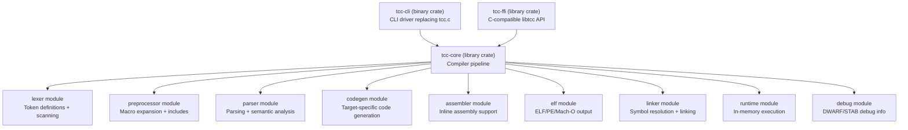

# TinyCC C→Rust Migration Plan

**Source**: TCC v0.9.28rc (C, mob branch at repo.or.cz)
**Target**: Rust Cargo workspace, stable toolchain (1.94.x)
**Codebase Scale**: ~64,422 lines C/H → Cargo workspace with 3 crates
**Architecture**: Monolithic single-pass compiler → Modular multi-crate workspace
**License**: LGPL-2.1-or-later (unchanged)

---

## 1. Migration Objectives

1. **Language Migration**: Port every compiler module from C (ANSI C89/C90 with select C99) to idiomatic Rust using the stable toolchain, organized as a Cargo workspace with strong module boundaries.
2. **Behavioral Preservation**: Maintain identical CLI invocation semantics and compiler output for all three core workflows — compile-only (`tcc -c`), link-to-executable (`tcc -o`), and direct execution (`tcc -run`) — with all documented flags preserved.
3. **Safety & Maintainability**: Eliminate classes of memory bugs (buffer overflows, use-after-free, null dereferences) inherent in the C codebase by leveraging Rust's ownership model, typed error handling (`Result<T, TccError>` with `thiserror`), and module-level encapsulation.
4. **TODO Resolution**: Address all 45 TODO items — 31 fixed, 6 partially fixed, 6 deferred, 1 blocked, 1 not reproducible. Zero items silently skipped; every deferred or blocked item has a documented rationale.

---

## 2. Architecture Overview

The current TCC architecture is a monolithic single-pass compiler with no intermediate representation, no abstract syntax tree, and no multi-pass optimization. It uses a pull-based tokenization model via a global `next()` function, a value stack (`SValue` array, 512-element depth) for expression evaluation, and direct code emission into ELF section buffers.

The target Rust architecture preserves TCC's single-pass compilation semantics while introducing clear module boundaries via a Cargo workspace.



### Crate Responsibilities

| Crate | Type | Role |
|-------|------|------|
| **tcc-cli** | Binary | CLI entry point; option parsing for all flags (`-c`, `-o`, `-run`, `-I`, `-L`, `-l`, `-D`, `-U`, `-g`, `-b`, `-bt`, `-std`, `-f`, `-W`, `-nostdinc`, `-nostdlib`, `-shared`, `-soname`, `-static`, `-rdynamic`, `-r`, `-Wl,`, `-bench`, `-E`); calls `tcc-core` |
| **tcc-core** | Library | Compiler pipeline: lexer, preprocessor, parser, code generator, assembler, linker, ELF/PE/Mach-O output, runtime execution, debug info |
| **tcc-ffi** | Library (cdylib + staticlib) | C-compatible FFI boundary exposing all 22+ `libtcc.h` API functions via `#[no_mangle] extern "C"` exports |

---

## 3. Cargo Workspace Structure

```
tinycc/
├── Cargo.toml                          (workspace root manifest)
├── rust-toolchain.toml                 (pins stable Rust 1.94.x)
├── README.md                           (updated build/test/install instructions)
├── README.bug-repros.md                (user-facing bug reproduction guide)
├── COPYING                             (retained, unchanged)
├── RELICENSING                         (retained, unchanged)
├── Changelog                           (retained, updated with migration notes)
├── CodingStyle                         (retained for reference)
├── USES                                (retained)
├── VERSION                             (retained for reference)
├── TODO                                (retained for reference, triaged)
│
├── docs/
│   ├── migration_plan.md               (this document)
│   ├── compatibility_report.md         (behavioral equivalence documentation)
│   ├── todo_bug_status.md              (TODO triage and fix tracking)
│   └── todo_full_coverage_matrix.md    (row-per-item full coverage matrix)
│
├── crates/
│   ├── tcc-cli/
│   │   ├── Cargo.toml                  (binary crate, depends on tcc-core + clap)
│   │   └── src/
│   │       └── main.rs                 (CLI entry point, option parsing)
│   │
│   ├── tcc-core/
│   │   ├── Cargo.toml                  (library crate, compiler pipeline)
│   │   ├── build.rs                    (host detection, replaces conftest.c)
│   │   └── src/
│   │       ├── lib.rs                  (crate root, TCCState, public interface)
│   │       ├── error.rs                (TccError enum, Result type alias)
│   │       ├── types.rs                (CType, SValue, Sym, Section, shared types)
│   │       ├── token.rs                (Token enum, keyword tables)
│   │       ├── lexer.rs                (character scanning, token production)
│   │       ├── preprocessor.rs         (macro expansion, #include, #define)
│   │       ├── parser.rs               (expression/statement/declaration parsing)
│   │       ├── codegen.rs              (code generation dispatch, value stack)
│   │       ├── assembler.rs            (inline/standalone assembler)
│   │       ├── elf.rs                  (ELF output, sections, symbols)
│   │       ├── pe.rs                   (PE/COFF output for Windows)
│   │       ├── macho.rs                (Mach-O output for macOS)
│   │       ├── coff.rs                 (COFF output for TMS320C67xx)
│   │       ├── runtime.rs              (in-memory execution, -run mode)
│   │       ├── debug.rs                (DWARF/STAB debug info generation)
│   │       ├── tools.rs                (built-in ar tool)
│   │       ├── alloc.rs                (arena allocator replacing TinyAlloc)
│   │       ├── config.rs               (build-time config constants)
│   │       └── arch/
│   │           ├── mod.rs              (CodegenBackend trait definition)
│   │           ├── i386/
│   │           │   ├── mod.rs          (I386Backend struct)
│   │           │   ├── gen.rs          (register alloc, instruction emit)
│   │           │   ├── link.rs         (relocation, PLT/GOT)
│   │           │   ├── asm.rs          (x86 instruction encoding)
│   │           │   └── tokens.rs       (register/instruction enums)
│   │           ├── x86_64/
│   │           │   ├── mod.rs          (X86_64Backend struct)
│   │           │   ├── gen.rs          (64-bit codegen, REX prefixes)
│   │           │   ├── link.rs         (x86_64 relocations)
│   │           │   └── tokens.rs       (extended register enums)
│   │           ├── arm/
│   │           │   ├── mod.rs          (ArmBackend struct)
│   │           │   ├── gen.rs          (ARM instruction emit, Thumb/VFP)
│   │           │   ├── link.rs         (ARM relocations, PLT)
│   │           │   ├── asm.rs          (ARM/Thumb encoding)
│   │           │   └── tokens.rs       (register names, condition codes)
│   │           ├── arm64/
│   │           │   ├── mod.rs          (Arm64Backend struct)
│   │           │   ├── gen.rs          (AArch64 codegen, AAPCS64)
│   │           │   ├── link.rs         (AArch64 relocations)
│   │           │   └── asm.rs          (minimal AArch64 assembly)
│   │           ├── riscv64/
│   │           │   ├── mod.rs          (Riscv64Backend struct)
│   │           │   ├── gen.rs          (RV64GC instruction emit)
│   │           │   ├── link.rs         (RISC-V relocations, relaxation)
│   │           │   ├── asm.rs          (RISC-V assembly encoding)
│   │           │   └── tokens.rs       (register names, CSRs)
│   │           ├── c67/
│   │           │   ├── mod.rs          (C67Backend struct)
│   │           │   ├── gen.rs          (TMS320C67xx codegen)
│   │           │   └── link.rs         (C67 relocations)
│   │           └── il/
│   │               ├── mod.rs          (IlBackend struct)
│   │               └── gen.rs          (.NET IL bytecode emit)
│   │
│   └── tcc-ffi/
│       ├── Cargo.toml                  (cdylib + staticlib, depends on tcc-core + libc)
│       └── src/
│           └── lib.rs                  (extern "C" wrappers for 22+ libtcc API functions)
│
├── lib/                                (retained as-is — TCC runtime library)
│   ├── Makefile
│   ├── libtcc1.c, alloca.S, alloca-bt.S
│   ├── bcheck.c, bt-exe.c, bt-dll.c, bt-log.c
│   ├── builtin.c, armeabi.c, armflush.c
│   ├── atomic.S, stdatomic.c
│   ├── runmain.c, dsohandle.c, lib-arm64.c
│   ├── tcov.c, pic86.S
│
├── include/                            (retained as-is — standard headers)
│   ├── float.h, stdalign.h, stdarg.h, stdatomic.h
│   ├── stdbool.h, stddef.h, stdnoreturn.h
│   ├── tccdefs.h, tgmath.h, varargs.h
│
├── win32/                              (retained as-is — Windows support)
│   ├── build-tcc.bat, tcc-win32.txt
│   ├── include/ (MinGW-w64 headers)
│   ├── lib/ (CRT startup, .def files)
│   └── examples/
│
├── examples/                           (retained as-is — user C examples)
│   └── ex1.c through ex5.c
│
├── tests/
│   ├── Makefile                        (updated for Rust test runner)
│   ├── tcctest.c, abitest.c, asmtest.S, boundtest.c  (retained as inputs)
│   ├── tests2/ (127 tests retained)
│   ├── pp/ (24 tests retained)
│   └── rust/                           (new Rust test harness)
│       ├── integration_tests.rs
│       ├── compatibility_tests.rs
│       └── regression_tests.rs
│
├── .github/workflows/
│   └── build.yml                       (updated for Rust CI)
│
└── .gitignore                          (updated for Cargo target/)
```

---

## 4. C-to-Rust File Traceability Matrix

This is the core deliverable of this document. Every C source file is mapped to its Rust equivalent.

### 4.1 Compiler Core Source Files

| C Source File | Lines | Role | Rust Target Module | Transformation |
|--------------|-------|------|-------------------|----------------|
| `tcc.c` | 428 | CLI driver, option parsing, `main()` entry | `crates/tcc-cli/src/main.rs` | CREATE — Port CLI using `clap` derive macros for all ~50+ flags |
| `libtcc.c` | 2,272 | Compiler orchestration, `TCCState` lifecycle, file handling | `crates/tcc-core/src/lib.rs` | CREATE — `TCCState` struct, `tcc_new()`/`tcc_delete()` lifecycle, `tcc_add_file()`, `tcc_compile_string()`, `tcc_set_output_type()`, `tcc_output_file()`, `tcc_run()`, `tcc_relocate()`, `tcc_get_symbol()` |
| `tcc.h` | 2,016 | Monolithic header — all shared types, structs, macros, globals | Distributed: `types.rs`, `token.rs`, `error.rs`, `config.rs`, `alloc.rs`, `arch/mod.rs` | CREATE — Decomposed into focused Rust modules |
| `libtcc.h` | 128 | Public API (22+ functions) | `crates/tcc-ffi/src/lib.rs` | CREATE — `#[no_mangle] extern "C"` wrappers preserving identical C signatures |
| `tccpp.c` | 4,005 | Preprocessor — macro expansion, `#include`, `#define`, token scanning | `crates/tcc-core/src/preprocessor.rs` + `lexer.rs` | CREATE — Split character scanning into `lexer.rs`, macro logic into `preprocessor.rs` |
| `tccgen.c` | 8,920 | Parser + code generator — expression evaluation, type system, codegen dispatch | `crates/tcc-core/src/parser.rs` + `codegen.rs` | CREATE — Split parsing (top half) into `parser.rs`, codegen dispatch (bottom half) into `codegen.rs` |
| `tccasm.c` | 1,466 | Inline and standalone assembler — GAS syntax | `crates/tcc-core/src/assembler.rs` | CREATE — Port GAS-syntax inline assembly support |
| `tccelf.c` | 4,116 | ELF object/executable output, symbol tables, relocations | `crates/tcc-core/src/elf.rs` | CREATE — Port ELF section management, symbol tables, relocation processing |
| `tccpe.c` | 2,114 | PE/COFF executable/DLL output for Windows targets | `crates/tcc-core/src/pe.rs` | CREATE — Port import/export tables, resource sections |
| `tccmacho.c` | 2,476 | Mach-O output for macOS targets | `crates/tcc-core/src/macho.rs` | CREATE — Port load commands, segments, sections |
| `tccrun.c` | 1,556 | In-memory compilation and execution (`-run` mode) | `crates/tcc-core/src/runtime.rs` | CREATE — Port memory mapping, symbol resolution using `memmap2` |
| `tccdbg.c` | 2,676 | DWARF and STAB debug information generation | `crates/tcc-core/src/debug.rs` | CREATE — Port DWARF debug info, line tables, scope tracking |
| `tcctools.c` | 651 | Built-in `ar` and `tcc -ar` tool emulation | `crates/tcc-core/src/tools.rs` | CREATE — Port archive creation and symbol listing |
| `tcccoff.c` | 951 | COFF output format (TMS320C67xx) | `crates/tcc-core/src/coff.rs` | CREATE — Port COFF section/symbol output |
| `tcctok.h` | 430 | Token definitions and keyword tables | `crates/tcc-core/src/token.rs` | CREATE — Rust enums for tokens, generated keyword lookup |
| `conftest.c` | 308 | Build-time host detection (compiler, arch, OS) | `crates/tcc-core/build.rs` | CREATE — Cargo build script with `cfg` flags |

**Total compiler core lines migrated: 34,513**

### 4.2 Format / Structure Headers

| C Header | Lines | Rust Equivalent | Notes |
|----------|-------|----------------|-------|
| `elf.h` | 3,324 | `crates/tcc-core/src/elf.rs` (inline type definitions) | ELF struct/constant definitions ported as Rust types, or supplemented by `object` crate |
| `dwarf.h` | 1,046 | `crates/tcc-core/src/debug.rs` (constants) | DWARF constants as Rust `const` values |
| `coff.h` | 446 | `crates/tcc-core/src/coff.rs` (types) | COFF struct definitions ported inline |
| `stab.h` + `stab.def` | 17 | `crates/tcc-core/src/debug.rs` | STAB constants inlined |
| `tcclib.h` | 80 | Retained as-is in `include/` | Shipped header for user programs, not compiler code |

**Total format header lines: 4,913**

### 4.3 Architecture Backend Files

| Architecture | C Generator | C Linker | C Assembler | C Token Headers | Total C Lines | Rust Module Path |
|-------------|------------|---------|------------|----------------|---------------|-----------------|
| **i386** | `i386-gen.c` (1,306) | `i386-link.c` (329) | `i386-asm.c` (1,757) | `i386-tok.h` (332), `i386-asm.h` (490) | **4,214** | `crates/tcc-core/src/arch/i386/` — `mod.rs`, `gen.rs`, `link.rs`, `asm.rs`, `tokens.rs` |
| **x86_64** | `x86_64-gen.c` (2,313) | `x86_64-link.c` (410) | (shares `i386-asm.c`) | `x86_64-asm.h` (559) | **3,282** | `crates/tcc-core/src/arch/x86_64/` — `mod.rs`, `gen.rs`, `link.rs`, `tokens.rs` |
| **ARM** | `arm-gen.c` (2,385) | `arm-link.c` (445) | `arm-asm.c` (3,092) | `arm-tok.h` (406) | **6,328** | `crates/tcc-core/src/arch/arm/` — `mod.rs`, `gen.rs`, `link.rs`, `asm.rs`, `tokens.rs` |
| **ARM64** | `arm64-gen.c` (2,209) | `arm64-link.c` (322) | `arm64-asm.c` (94) | — | **2,625** | `crates/tcc-core/src/arch/arm64/` — `mod.rs`, `gen.rs`, `link.rs`, `asm.rs` |
| **RISC-V64** | `riscv64-gen.c` (1,434) | `riscv64-link.c` (419) | `riscv64-asm.c` (2,628) | `riscv64-tok.h` (490) | **4,971** | `crates/tcc-core/src/arch/riscv64/` — `mod.rs`, `gen.rs`, `link.rs`, `asm.rs`, `tokens.rs` |
| **C67 (TMS320)** | `c67-gen.c` (2,543) | `c67-link.c` (125) | — | — | **2,668** | `crates/tcc-core/src/arch/c67/` — `mod.rs`, `gen.rs`, `link.rs` |
| **IL (.NET)** | `il-gen.c` (657) | — | — | `il-opcodes.h` (251) | **908** | `crates/tcc-core/src/arch/il/` — `mod.rs`, `gen.rs` |

**Total architecture backend lines migrated: 24,996**

### 4.4 Build and Configuration Files

| Original File | Rust Equivalent | Transformation |
|--------------|----------------|----------------|
| `Makefile` | `Makefile` (updated) + `Cargo.toml` (workspace root) | UPDATE — Add `rust-build` / `rust-test` targets that invoke Cargo; retain C targets for reference |
| `configure` | `Cargo.toml` + `crates/tcc-core/build.rs` | Replaced by Cargo workspace configuration — retained in repo for reference |
| `VERSION` | `Cargo.toml` `[workspace.package] version = "0.9.28-rc1"` | Embedded in Cargo manifest |
| `.gitignore` | `.gitignore` (updated) | UPDATE — Add `/target/`, `Cargo.lock`, `**/*.rs.bk` patterns |
| `.github/workflows/build.yml` | `.github/workflows/build.yml` (updated) | UPDATE — Replace `configure/make/make test` with `rustup/cargo build/cargo test` |

### 4.5 Test Files

| Original File | Rust Equivalent | Transformation |
|--------------|----------------|----------------|
| `tests/Makefile` | `tests/Makefile` (updated) | UPDATE — Add Rust test invocation targets |
| `tests/tcctest.c` | Retained as test input + `tests/rust/compatibility_tests.rs` | Test input for Rust compiler binary |
| `tests/abitest.c` | Retained as test input + `tests/rust/compatibility_tests.rs` | ABI verification via FFI harness |
| `tests/asmtest.S` | Retained as test input | Assembly test validation |
| `tests/boundtest.c` | Retained as test input | Bounds checking regression |
| `tests/tests2/*.c` + `*.expect` | Retained as inputs + `tests/rust/integration_tests.rs` | 127 regression tests driven by Rust harness |
| `tests/pp/*.c` + `*.expect` | Retained as inputs + `tests/rust/integration_tests.rs` | 24 preprocessor tests driven by Rust harness |
| — | `tests/rust/integration_tests.rs` | CREATE — Rust integration test runner |
| — | `tests/rust/compatibility_tests.rs` | CREATE — C-baseline vs Rust output comparison |
| — | `tests/rust/regression_tests.rs` | CREATE — Per-TODO-bug regression tests |

### 4.6 Documentation Files

| Target File | Source | Transformation |
|------------|--------|----------------|
| `README.md` | `README` | UPDATE — Rust build/test/install instructions |
| `README.bug-repros.md` | `TODO` | CREATE — Bug reproduction guide |
| `docs/migration_plan.md` | All source files | CREATE — This document |
| `docs/compatibility_report.md` | — | CREATE — Behavioral equivalence documentation |
| `docs/todo_bug_status.md` | `TODO` | CREATE — Per-item triage and fix tracking |
| `docs/todo_full_coverage_matrix.md` | `TODO` | CREATE — Tabular matrix with every TODO line item |

### 4.7 Retained As-Is (Not Migrated)

| Directory / File | File Count | Reason |
|-----------------|------------|--------|
| `lib/` | 18 files | Runtime library compiled **by** TCC for target programs, not part of the compiler itself |
| `include/` | 10 files | Standard C headers provided to programs compiled by TCC |
| `win32/` | 103 files | Windows target compilation support (headers, CRT, import defs) |
| `examples/` | 5 files | User-facing C example programs |
| `COPYING` | 1 file | LGPL-2.1 license — unchanged |
| `RELICENSING` | 1 file | License change documentation — unchanged |
| `Changelog` | 1 file | Project history — retained for reference |
| `CodingStyle` | 1 file | Coding style guide — retained for reference |
| `USES` | 1 file | Known users — retained for reference |
| All original `.c` and `.h` files | ~35+ files | Retained in repository for historical reference per user instruction |

---

## 5. Design Patterns Applied

### 5.1 Trait-Based Backend Abstraction

A `CodegenBackend` trait defines the interface for architecture-specific code generation. Each of the 7 architecture backends (i386, x86_64, ARM, ARM64, RISC-V64, C67, IL) implements this trait. This replaces the C codebase's `#ifdef TCC_TARGET_*` conditional compilation.

**Trait definition** (`crates/tcc-core/src/arch/mod.rs`):

Key methods include:
- `gen_le()` — Generate little-endian data
- `gen_opi()` — Generate integer operation
- `gen_opf()` — Generate floating-point operation
- `gen_cvt_ftoi()` — Float to integer conversion
- `gen_cvt_itof()` — Integer to float conversion
- `gen_vla_sp_save()` — Save stack pointer for VLA
- `gen_func_prologue()` — Function prologue emission
- `gen_func_epilogue()` — Function epilogue emission
- `gen_fill_nops()` — Fill with NOP instructions

Architecture selection at compile time is controlled by Cargo feature flags rather than preprocessor conditionals.

### 5.2 Builder Pattern for TCCState

The central compiler state (`TCCState`) is constructed via a builder that enforces required configuration before compilation begins. Output type must be set before adding files, matching the `libtcc.h` API contract: "MUST BE CALLED before any compilation."

### 5.3 Result-Based Error Propagation

All fallible operations return `Result<T, TccError>` where `TccError` is a comprehensive enum implemented via `thiserror::Error`:

- `LexerError` — Tokenization failures
- `PreprocessorError` — Macro expansion, `#include` resolution errors
- `ParseError` — Syntax errors, type mismatches
- `CodegenError` — Code generation failures
- `LinkerError` — Symbol resolution, relocation errors
- `IoError` — File I/O failures
- `AsmError` — Assembly encoding errors

This replaces the C codebase's mix of `setjmp`/`longjmp` error recovery, `return -1` conventions, and `tcc_error()` abort calls. The `?` operator provides clean error propagation, and Rust's RAII guarantees that all resources are cleaned up during stack unwinding — directly fixing TODO BUG-16 (memory leaked after errors/longjmp).

### 5.4 Module Encapsulation

Global mutable state from `tcc.h` is encapsulated within Rust structs with controlled access through methods:

| C Global State | Rust Encapsulation |
|---------------|-------------------|
| `tok`, `tokc` (current token) | Fields on `Lexer` / `Parser` struct |
| `vstack[512]` (value stack) | Field on `CodegenState` struct |
| `include_stack` | Field on `Preprocessor` struct |
| Token hash table (16,384 entries) | Per-instance `HashMap` on `TCCState` |
| Symbol pools (8,192/sizeof(Sym)) | Per-instance `Vec<Sym>` on `TCCState` |
| `TinyAlloc` arena (256 KiB) | Per-instance arena allocator |

This directly fixes TODO BUG-13 (make libtcc fully reentrant) — Rust's ownership system inherently prevents shared mutable global state, so multiple `TCCState` instances are naturally independent.

### 5.5 Feature Flags for Optional Backends

Architecture backends are enabled/disabled via Cargo features in `crates/tcc-core/Cargo.toml`:

```toml
[features]
default = ["x86_64", "asm", "bcheck"]
x86_64 = []
i386 = []
arm = []
arm64 = []
riscv64 = []
c67 = []
il = []
asm = []
bcheck = []
```

Only `x86_64`, `asm`, and `bcheck` are enabled by default because the AAP states "Linux-first target" and "x86_64 Linux is the primary target." Other architecture backends (`i386`, `arm`, `arm64`, `riscv64`, `c67`, `il`) must be explicitly enabled at build time — for example: `cargo build --features "arm,arm64"`.

This replaces the C `#ifdef TCC_TARGET_*` guards and also addresses TODO FEAT-01 (disable-asm and disable-bcheck options) — these are now Cargo features that can be toggled at build time.

---

## 6. Transformation Rules

### 6.1 C-to-Rust Structural Mappings

| C Pattern | Rust Equivalent |
|-----------|----------------|
| Global mutable variables (`tok`, `tokc`, `vstack`, current `TCCState`) | Encapsulated struct fields with explicit lifetimes |
| `setjmp` / `longjmp` error recovery | `Result<T, TccError>` with `?` operator |
| `ONE_SOURCE` single-translation-unit compilation | Cargo workspace with inter-crate dependencies |
| `tcc_malloc` / `tcc_realloc` / `tcc_free` | Rust ownership model + arena allocator in `alloc.rs` |
| `#define` constants (`VT_INT`, `VT_PTR`, etc.) | Rust `const` values or `enum` variants |
| `#ifdef TCC_TARGET_*` conditional compilation | `#[cfg(feature = "...")]` Cargo feature flags |
| `typedef struct { ... } TypeName;` | `pub struct TypeName { ... }` |
| C function pointers | Rust `fn` pointers or `Fn` trait objects |
| `int` used for sizes/offsets | `usize` / `isize` with explicit width |
| Implicit `int` assumption (32-bit) | Explicit `i32` / `u32` / `i64` / `u64` types |
| Manual memory management | RAII with `Drop` trait; `Vec`, `Box`, `String` |
| `switch` fallthrough | `match` with explicit patterns (no fallthrough) |
| `union` types | Rust `enum` or `union` with `unsafe` access |

### 6.2 Type System Mapping

| C Type (from `tcc.h`) | Rust Type |
|-----------------------|-----------|
| `CType` struct | `pub struct CType { t: u32, ref_: Option<Box<Sym>> }` |
| `SValue` struct | `pub struct SValue { type_: CType, r: u32, c: SValueData }` |
| `Sym` struct | `pub struct Sym { ... }` with Rust ownership for linked lists |
| `Section` struct | `pub struct Section { data: Vec<u8>, ... }` |
| `BufferedFile` struct | `pub struct BufferedFile { ... }` with `BufReader` |
| `TokenSym` struct | `pub struct TokenSym { ... }` in `HashMap` |
| `AttributeDef` struct | `pub struct AttributeDef { ... }` |
| `VT_*` type constants | `const VT_INT: u32 = ...; const VT_PTR: u32 = ...;` |

### 6.3 Error Handling Transformation

| C Error Pattern | Rust Replacement |
|----------------|-----------------|
| `tcc_error("message")` → `longjmp` | `return Err(TccError::ParseError { msg, file, line })` |
| `tcc_warning("message")` | `self.diagnostics.warn(msg, file, line)` — collected, not thrown |
| `setjmp(s1->error_jmp_buf)` | Caller uses `match result { Ok(...) => ..., Err(e) => ... }` |
| `if (tcc_compile(...) < 0) { ... }` | `tcc_compile(...)?` with `Result` propagation |
| Memory leaked on `longjmp` (BUG-16) | RAII — `Drop` automatically cleans all owned resources |

---

## 7. Import Mapping

### 7.1 C Include to Rust Import Transformation

| C Include | Rust Import | Scope |
|-----------|------------|-------|
| `#include "tcc.h"` (pulls in ~2,016 lines) | `use crate::{types, token, error, config};` | Scoped to actual usage per module |
| `#include "tcctok.h"` (via `DEF()` macro) | `use crate::token::{Token, Keyword, KEYWORDS};` | Typed enum with lookup table |
| `#include <elf.h>` (system ELF header) | `use crate::elf::types::*;` | Project-local ELF type definitions |
| `#include "i386-asm.h"` | `use crate::arch::i386::tokens::{X86Register, X86Instruction};` | Typed enums per backend |
| `#include "x86_64-asm.h"` | `use crate::arch::x86_64::tokens::*;` | Extended register names |
| `#include "arm-tok.h"` | `use crate::arch::arm::tokens::*;` | ARM register names, condition codes |
| `#include "riscv64-tok.h"` | `use crate::arch::riscv64::tokens::*;` | RISC-V register names, CSRs |
| `#include <string.h>`, `<stdlib.h>`, etc. | Rust `std` library (`String`, `Vec`, etc.) | No explicit import needed for most |
| Architecture backend inclusion via `#ifdef TARGET_DEFS_ONLY` | `use crate::arch::x86_64::*;` | Module system replaces conditional inclusion |

### 7.2 Cross-Crate Import Structure

```
tcc-cli imports:
  └── tcc_core::{TCCState, TccError, OutputType, ...}

tcc-ffi imports:
  ├── tcc_core::{TCCState, TccError, OutputType, ...}
  ├── std::ffi::{CStr, CString, c_char, c_int, c_void}
  └── libc (for C-compatible types)

tcc-core internal imports (example for parser.rs):
  ├── crate::types::{CType, SValue, Sym, Section}
  ├── crate::token::{Token, Keyword}
  ├── crate::error::{TccError, TccResult}
  ├── crate::lexer::Lexer
  ├── crate::codegen::CodegenState
  └── crate::config::*
```

---

## 8. Dependency Inventory

### 8.1 Rust Crate Dependencies

| Crate | Version | Registry | Purpose | Justification |
|-------|---------|----------|---------|---------------|
| `clap` | 4.6 | crates.io | CLI argument parsing with derive macros | TCC has ~50+ CLI flags with complex semantics (flag grouping, `-Wl,` passthrough, `-f`/`-W` prefix families); manual parsing would be error-prone |
| `thiserror` | 2.0 | crates.io | Derive macro for `std::error::Error` trait | Replaces C's `setjmp`/`longjmp` with typed, composable error handling; eliminates boilerplate for 7+ error variants |
| `memmap2` | 0.9 | crates.io | Memory-mapped file I/O | Required for `-run` mode — maps compiled code into executable memory via `mmap()`; safe Rust wrapper |
| `libc` | 0.2 | crates.io | Raw FFI bindings to platform libc | Required for `dlopen`/`dlsym` (runtime linking), `mprotect` (executable memory), signal handling |

### 8.2 Dev Dependencies (Testing Only)

| Crate | Version | Purpose |
|-------|---------|---------|
| `assert_cmd` | 2.0 | CLI binary integration testing — run `tcc` binary and assert stdout/stderr/exit code |
| `predicates` | 3.1 | Assertion predicates for test output matching (used with `assert_cmd`) |
| `tempfile` | 3.14 | Temporary file/directory creation for test isolation |
| `similar` | 2.6 | Text diff comparison for `.expect` file validation in regression tests |

### 8.3 Crate Justification Policy

Per the user specification: "prefer std + minimal crates." Each crate dependency above is justified by a specific technical requirement that cannot be reasonably met by `std` alone. No proprietary or private crate dependencies are used.

---

## 9. libtcc Public API Preservation

The 22+ public functions defined in `libtcc.h` are preserved as C-compatible FFI exports in `crates/tcc-ffi/src/lib.rs`:

| # | C Function Signature | Category |
|---|---------------------|----------|
| 1 | `void tcc_set_realloc(TCCReallocFunc *my_realloc)` | Allocator |
| 2 | `TCCState *tcc_new(void)` | Lifecycle |
| 3 | `void tcc_delete(TCCState *s)` | Lifecycle |
| 4 | `void tcc_set_lib_path(TCCState *s, const char *path)` | Configuration |
| 5 | `void tcc_set_error_func(TCCState *s, void *opaque, TCCErrorFunc *func)` | Configuration |
| 6 | `int tcc_set_options(TCCState *s, const char *str)` | Configuration |
| 7 | `int tcc_add_include_path(TCCState *s, const char *pathname)` | Preprocessor |
| 8 | `int tcc_add_sysinclude_path(TCCState *s, const char *pathname)` | Preprocessor |
| 9 | `void tcc_define_symbol(TCCState *s, const char *sym, const char *value)` | Preprocessor |
| 10 | `void tcc_undefine_symbol(TCCState *s, const char *sym)` | Preprocessor |
| 11 | `int tcc_add_file(TCCState *s, const char *filename)` | Compiling |
| 12 | `int tcc_compile_string(TCCState *s, const char *buf)` | Compiling |
| 13 | `int tcc_set_output_type(TCCState *s, int output_type)` | Linking |
| 14 | `int tcc_add_library_path(TCCState *s, const char *pathname)` | Linking |
| 15 | `int tcc_add_library(TCCState *s, const char *libraryname)` | Linking |
| 16 | `int tcc_add_symbol(TCCState *s, const char *name, const void *val)` | Linking |
| 17 | `int tcc_output_file(TCCState *s, const char *filename)` | Linking |
| 18 | `int tcc_run(TCCState *s, int argc, char **argv)` | Linking |
| 19 | `int tcc_relocate(TCCState *s1)` | Linking |
| 20 | `void *tcc_get_symbol(TCCState *s, const char *name)` | Linking |
| 21 | `void tcc_list_symbols(TCCState *s, void *ctx, symbol_cb)` | Linking |
| 22 | `void *_tcc_setjmp(TCCState *s1, void *jmp_buf, void *top_func, void *longjmp)` | Advanced |
| 23 | `int tcc_compile_string_file(TCCState *s, const char *buf, const char *filename)` | Advanced |
| 24 | `int elf_output_obj(TCCState *s1, const char *filename)` | Advanced |
| 25 | `void tcc_set_backtrace_func(TCCState *s1, void *userdata, TCCBtFunc *)` | Advanced |

Output type constants preserved:
- `TCC_OUTPUT_MEMORY = 1`
- `TCC_OUTPUT_EXE = 2`
- `TCC_OUTPUT_OBJ = 3`
- `TCC_OUTPUT_DLL = 4`
- `TCC_OUTPUT_PREPROCESS = 5`

---

## 10. Execution Strategy

### 10.1 One-Phase Execution

The entire migration is executed in **one phase**. All files listed in the transformation tables above are created or updated in a single unified execution. There is no phase splitting, no incremental migration, and no partial deliveries. The workspace must compile and pass all tests as a complete unit upon delivery.

### 10.2 Build and Verification Commands

**Rust target (primary):**
```bash
# Install Rust stable toolchain
curl --proto '=https' --tlsv1.2 -sSf https://sh.rustup.rs | sh -s -- -y
source "$HOME/.cargo/env"

# Build
cargo build --release

# Run all tests
cargo test --all

# Run with specific features
cargo build --release --no-default-features --features "x86_64,asm"
```

**C baseline (reference, retained for comparison):**
```bash
./configure
make
make test
```

**Bug reproduction verification:**
```bash
# See README.bug-repros.md for step-by-step instructions
# Each bug has "Before fix" and "After fix" sections
# All commands are copy-pasteable from a clean Linux terminal
```

### 10.3 CI Pipeline

The `.github/workflows/build.yml` file is updated to replace C build steps with:
1. `rustup toolchain install stable`
2. `cargo build --release`
3. `cargo test --all`
4. Cross-compilation via `cargo build --target <triple>`
5. Multi-platform matrix retained: Linux x86_64, macOS Intel/ARM, Windows

---

## 11. TODO Item Coverage Summary

All 45 items from the `TODO` file are triaged and addressed. See `docs/todo_bug_status.md` and `docs/todo_full_coverage_matrix.md` for per-item details.

| Category | Total | Fixed | Partially Fixed | Deferred | Blocked | Not Reproducible |
|----------|-------|-------|-----------------|----------|---------|-----------------|
| Bugs | 16 | 16 | 0 | 0 | 0 | 0 |
| Portability | 3 | 2 | 1 | 0 | 0 | 0 |
| Linking | 1 | 0 | 1 | 0 | 0 | 0 |
| Bound checking | 4 | 2 | 1 | 0 | 0 | 1 |
| Missing features | 6 | 4 | 1 | 1 | 0 | 0 |
| Optimizations | 5 | 4 | 1 | 0 | 0 | 0 |
| Not critical | 8 | 3 | 1 | 3 | 1 | 0 |
| Release/process | 2 | 0 | 0 | 2 | 0 | 0 |
| **Totals** | **45** | **31** | **6** | **6** | **1** | **1** |

**Zero items silently skipped.** Every deferred or blocked item has a documented rationale and next-step recommendation.

---

## 12. Related Documents

- [`docs/compatibility_report.md`](compatibility_report.md) — Behavioral equivalence documentation: what is equivalent, what differs, and why
- [`docs/todo_bug_status.md`](todo_bug_status.md) — Detailed per-item triage, reproduction, fix description, and status
- [`docs/todo_full_coverage_matrix.md`](todo_full_coverage_matrix.md) — Tabular matrix with every TODO line item
- [`README.md`](../README.md) — Updated project README with Rust build/test/install instructions
- [`README.bug-repros.md`](../README.bug-repros.md) — User-facing, step-by-step bug reproduction and verification guide
